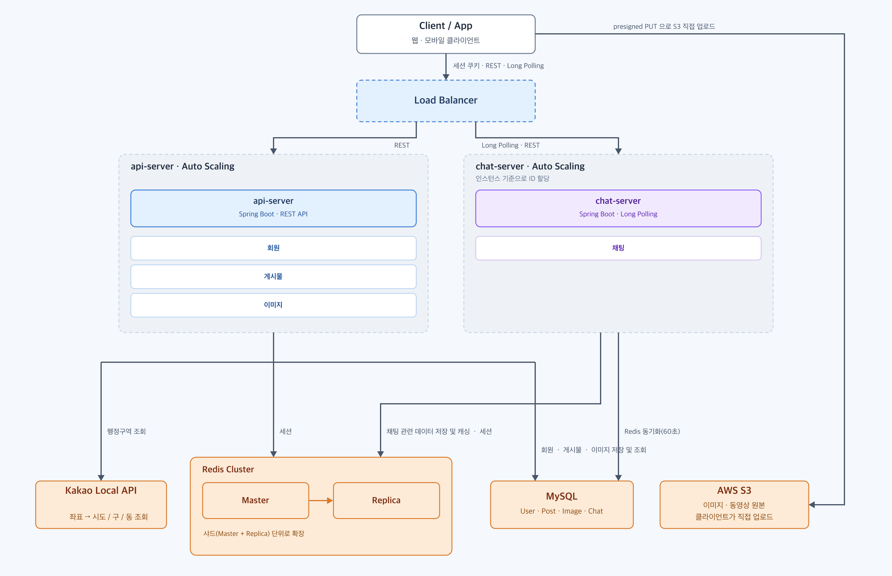
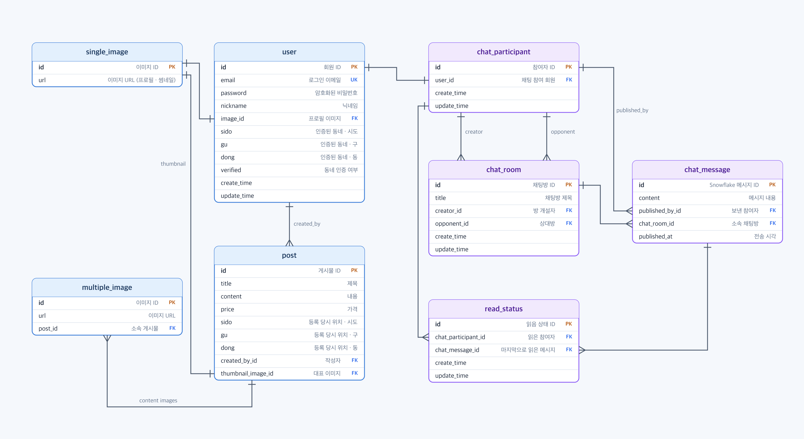

### Carrot Project
* 당근마켓 같은 동네 기반 중고 거래 · 1:1 채팅 서비스 개발
* 1:1 채팅 기능, 사진 업로드, 동영상 업로드 기능을 구현하는것이 목표입니다.
* 서비스의 중요한 지표로 Latency보다 일정한 시간동안 클라이언트의 커넥션 수를 최대화하는것을 목표로 설정하였습니다.
* API 문서화와 단위 · 통합 테스트(Testcontainers)를 높은 우선순위로 두고, SonarCloud 정적 분석을 CI에 붙여 협업이 가능한 프로젝트로 만들었습니다.

## Carrot 서버 구조도

## 비즈니스 issue 해결 과정

* [한정된 소켓수로 최대한 다양한 클라이언트의 처리를 받기 위해서는 어떤 구조가 적합할까?](docs/issues/long-polling-concurrency.md)
* [다른 인스턴스에서 동시에 같은 pk 발행된다면?](docs/issues/distributed-id-snowflake.md)
* [두 개의 Command를 하나의 트랜잭션으로 처리하고 싶을 때 어떻게 해야할까?](docs/issues/redis-atomic-rollback.md)
* [TTL 키 전략을 어떤식으로 가져가야할까?](docs/issues/redis-ttl-sync.md)

## 프로젝트 중점사항
* 버전관리(feature별로 branch 전략)
* 문서화 (API 명세서, 유스케이스 명세서)
* 각 모듈(api-server, chat-server)이 독립적으로 auto-scaling이 가능하도록 multi-module 구조로 개발
* 공통 설정(Java 21, Spring Boot, 테스트 의존성)을 한 곳에서 관리하도록 buildSrc 컨벤션 플러그인으로 개발
* Redis를 기반으로 한 Session 저장 방식
* 실시간 통신 대신 Long Polling 구조로 채팅 서버 구현
* Redis를 채팅 관련 1차 저장소로, DB를 최종 저장소로 사용
* Redis -> DB 동기화 스케줄러 기능 개발

## DB ERD

## 문서
* [Use Case](docs/USE_CASE.md) - 로그인 · 이미지 업로드 · 채팅 전송 · Long Polling · 동기화 흐름의 시퀀스 다이어그램과 설계 포인트
* [API 명세서](docs/API.md) - 전체 엔드포인트의 요청 · 응답 · 실패 코드
