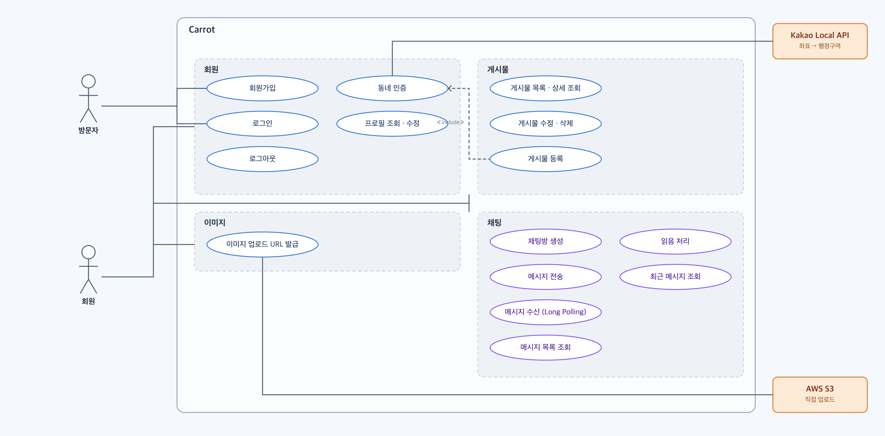
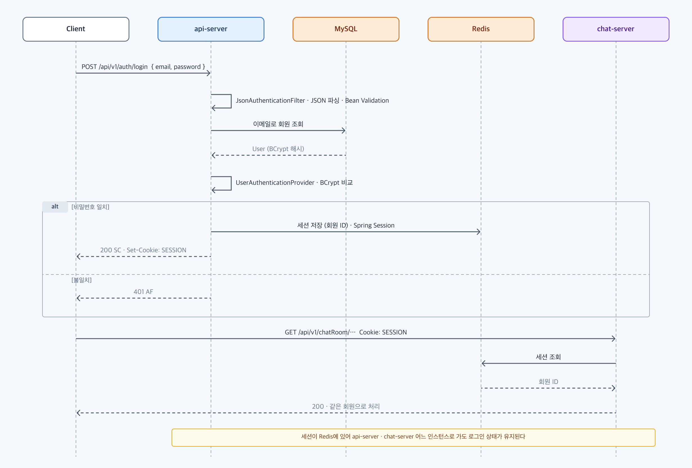
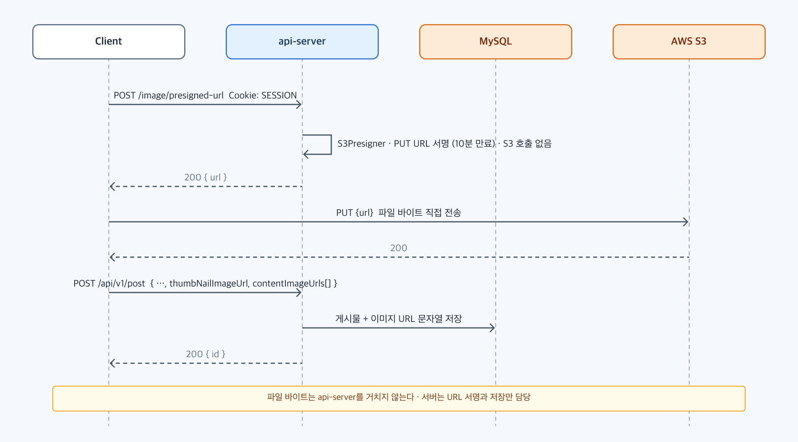
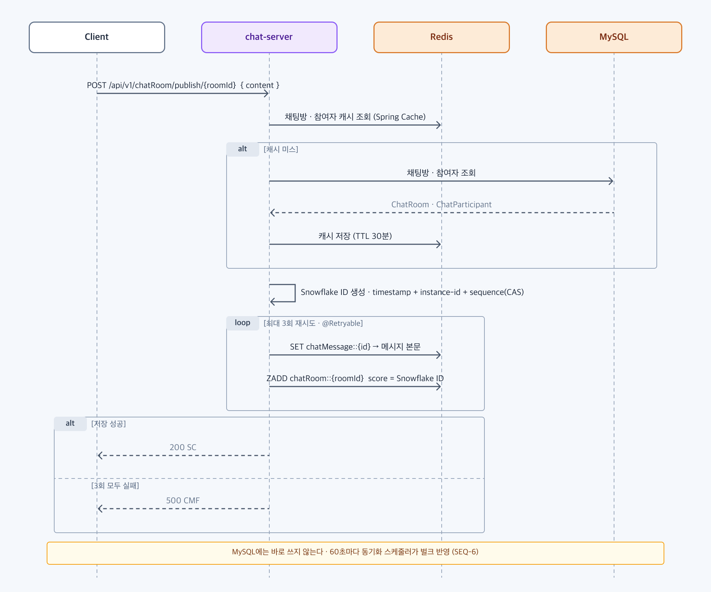
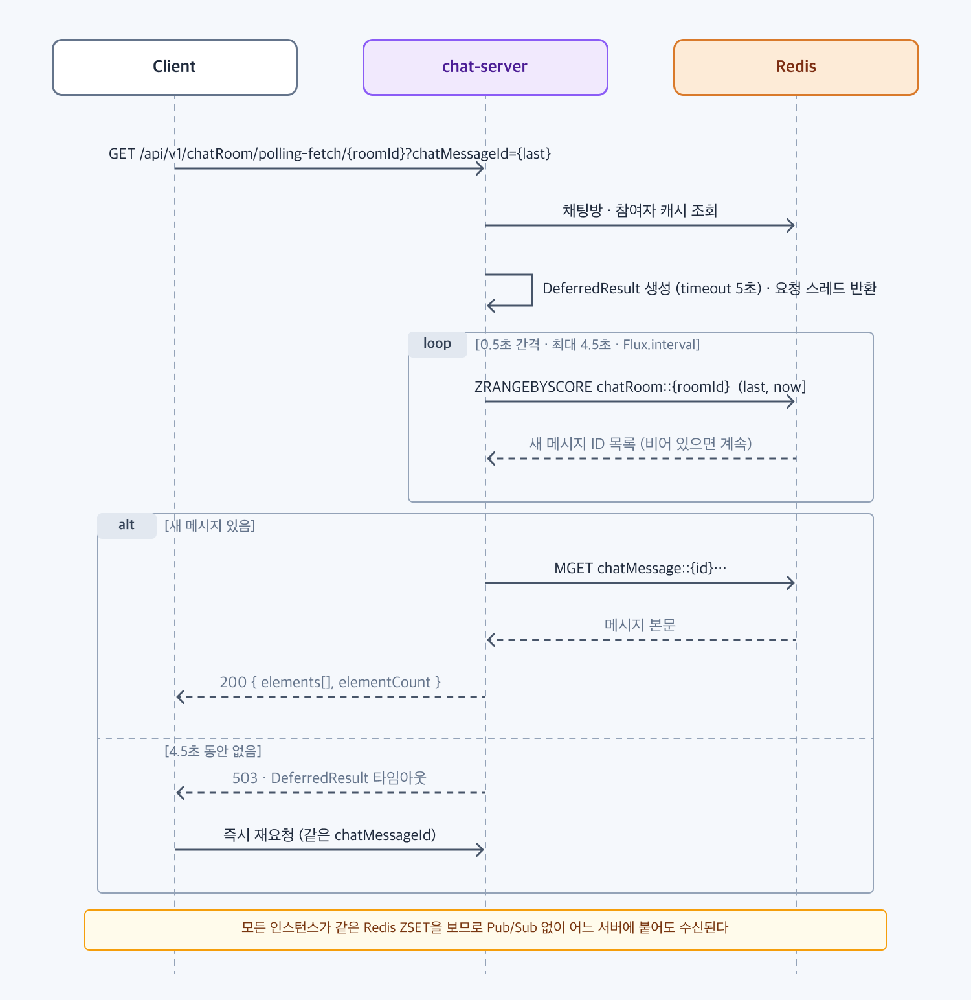
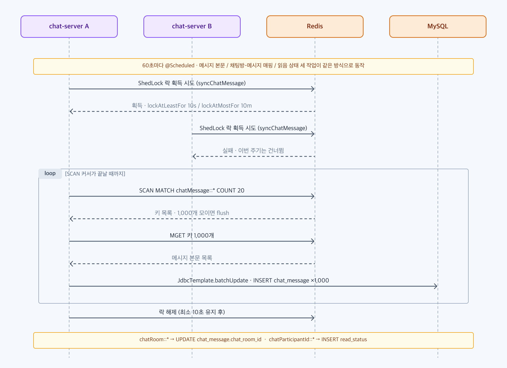

# Use Case

| 액터 | 설명 |
| --- | --- |
| 방문자 | 가입 전 사용자. 회원가입과 로그인만 가능 |
| 회원 | 로그인한 사용자. 세션 쿠키로 인증되며 나머지 모든 기능 사용 |
| Kakao Local API | 좌표를 시도 / 구 / 동으로 변환하는 외부 시스템 |
| AWS S3 | presigned URL로 클라이언트가 직접 파일을 올리는 저장소 |

단순 CRUD는 [API 명세서](API.md)에 있습니다. 아래는 별도 설계가 들어간 다섯 흐름을 시퀀스 다이어그램으로 정리한 것입니다.

---

## 1. 로그인과 세션 공유

- 폼 로그인 대신 `JsonAuthenticationFilter`가 JSON 본문을 읽고 검증한다.
- 세션은 Spring Session을 통해 Redis에 저장된다. 서버는 로그인 상태를 메모리에 갖지 않는다.
- 같은 세션 쿠키로 `api-server`, `chat-server` 어느 인스턴스에 가도 같은 회원으로 처리되므로 서버를 늘릴 수 있다.

## 2. 이미지 직접 업로드

- `S3Presigner`가 10분 만료 PUT URL을 서명만 해서 돌려준다. 이 단계에서 S3 호출은 없다.
- 파일 바이트는 클라이언트에서 S3로 바로 간다. API 서버는 업로드된 URL 문자열만 저장한다.
- 업로드 트래픽이 API 서버 확장과 무관해진다.

## 3. 채팅 메시지 전송

- 채팅방 · 참여자 존재 확인은 Spring Cache(Redis, TTL 30분)로 캐싱해 MySQL 조회를 줄인다.
- 메시지 ID는 Snowflake(timestamp + instance-id + sequence). 서버가 여러 대여도 충돌하지 않고 시간 순 정렬이 되며, 시퀀스 증가는 CAS로 락 없이 처리한다.
- Redis에 본문(`chatMessage::{id}`)과 채팅방별 ZSET(`chatRoom::{roomId}`, score = Snowflake ID)을 쓴다. Redis는 롤백이 없어 `@Retryable`로 3회 재시도한다.
- MySQL에는 바로 쓰지 않고 흐름 5의 스케줄러가 묶어서 반영한다.

## 4. 메시지 수신 (Long Polling)

- `DeferredResult`(5초)로 요청 스레드를 바로 돌려주고, `Flux.interval`이 0.5초마다 ZSET을 `(마지막 ID, 현재 시각]` 범위로 조회한다. Snowflake ID가 시간 순이라 score 범위 조회로 "그 이후 메시지"를 얻는다.
- 새 메시지가 있으면 `MGET`으로 본문을 한 번에 가져와 즉시 응답한다. 4.5초 동안 없으면 503 타임아웃이고 클라이언트가 재요청한다.
- 모든 인스턴스가 같은 Redis ZSET을 보므로 Pub/Sub이나 인스턴스 간 연결 없이 어느 서버에 붙어도 수신된다.

## 5. Redis → MySQL 동기화

- `ChatScheduler`가 60초마다 메시지 본문, 채팅방-메시지 매핑, 읽음 상태 세 작업을 돌린다.
- 각 작업은 ShedLock(Redis 락)으로 감싸여 여러 인스턴스 중 한 곳에서만 실행된다. 락은 최소 10초, 최대 10분 유지된다.
- `KEYS` 대신 `SCAN`으로 키를 순회하고, 1,000개 단위로 `MGET`한 뒤 `JdbcTemplate.batchUpdate`로 벌크 반영한다.
- 메시지 목록 · 최근 메시지 조회는 MySQL을 읽으므로 최대 60초 지연이 있다. 실시간은 흐름 4를 쓴다.
