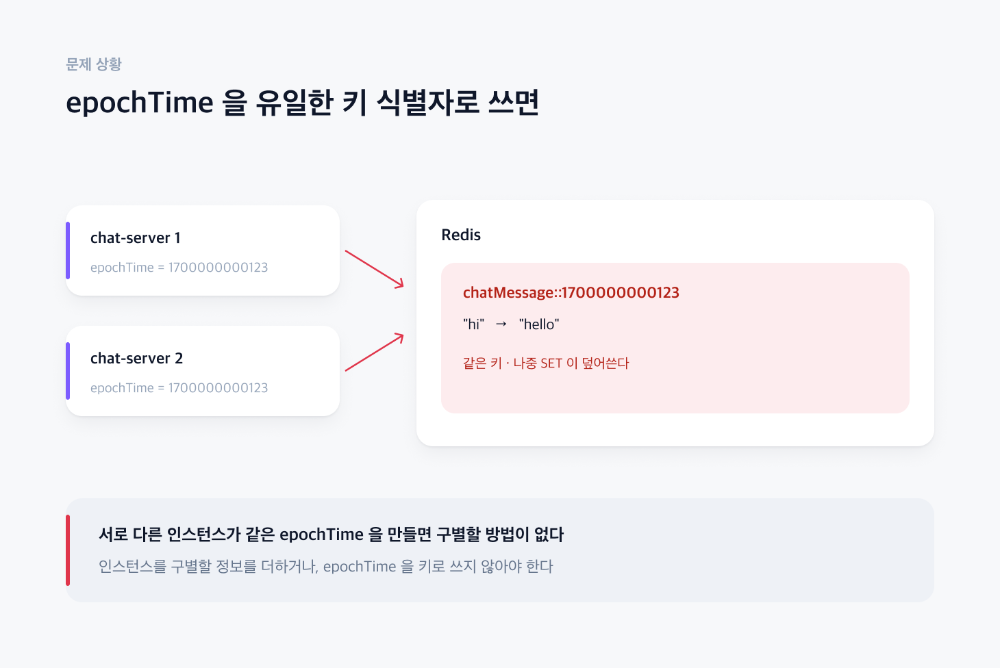
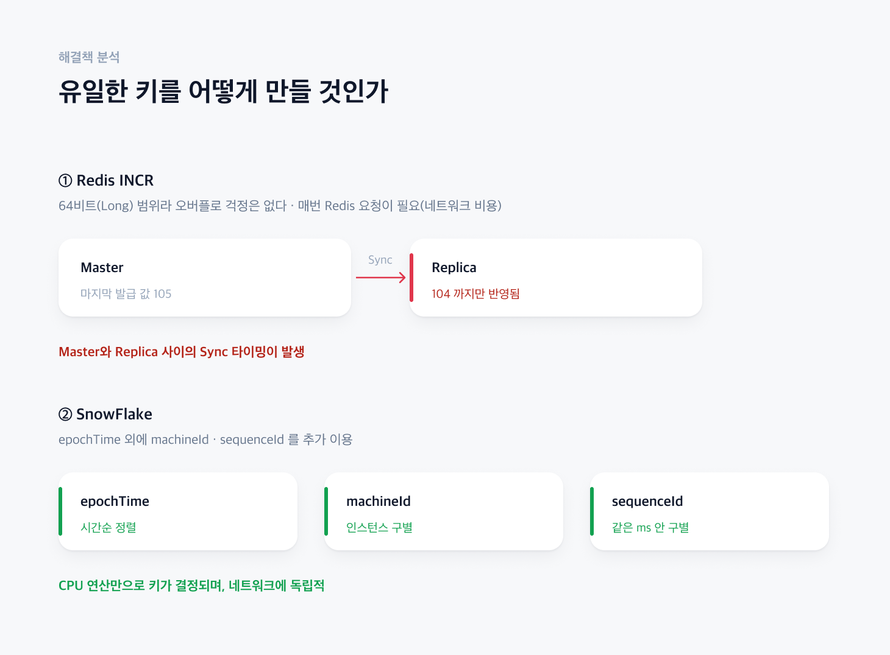
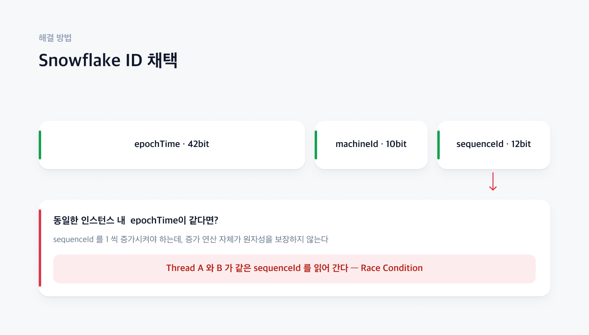
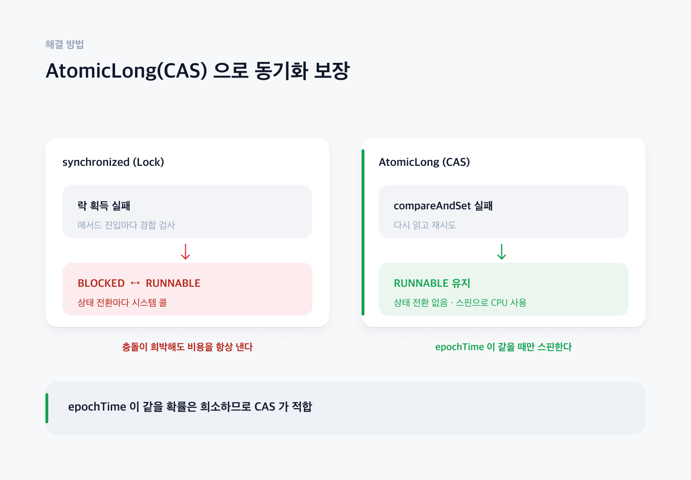

# 다른 인스턴스에서 동시에 같은 pk 발행된다면?

## 1. 문제 상황

### [ 채팅 메시지가 Redis 에 저장되는 방식 및 epochTime을 유일한 키 식별자로 이용하게 된다면?]

1차적으로 채팅 메세지를 레디스에 저장할 때 epochTime을 유일한 키 정보로 이용하게 되면, 
서로 다른 인스턴스에서 epochTime이 동일하게 되면 결국 Redis에서 데이터를 덮어 씌워지는 문제가 발생한다.
즉, 서로 다른 인스턴스를 구별할 수 있도록 epochTime말고 다른 정보가 필요하거나, 아니면 키 정보로 epochTime을 사용하면 안된다.

## 2. 해결책 분석

### [ Redis INCR - epochTime을 이용하지 않음]

분산 환경에서 유일한 키 식별자를 얻기 위하여 Redis INCR을 고려해 보았다. INCR의 데이터 범위는 64비트를 사용하므로 Long 타입과 동일하다. 
따라서, 실제로 Overflow날 경우도 희박하다. 하지만 만약 Redis가 내려가게 된다면(Replica) 내려가기 직전의 맨 마지막의 데이터를 가지고 있지 못할 가능성이 존재한다.(Sync 타이밍 차이)
즉, 데이터를 덮어 씌워지는 문제가 발생할 수 있다.

### [ SnowFlake - epochTime외 추가적인 정보 이용]
SnowFlake는 epochTime말고도 sequenceId, machineId 필드를 두기 때문에 서로 다른 인스턴스 간에 key를 구별할 수 있고, 그 뿐만 아니라 동일한 인스턴스 내에도 epochTime이 동일하더라도
sequenceId를 이용하여 구별할 수 있다.
그리고 Redis INCR과 비교하여 CPU 연산만으로 Key를 결정하기 때문에 네트워크 환경에 독립적이다.

## 3. 해결 방법

### [ Snowflake ID 채택 ]

상대적으로 네트워크에 독립적인 Key방식인 Snowflake 알고리즘을 선택
하지만, 같은 인스턴스 내에서 epochTime이 동일하다면 sequenceId를 1씩 증가시켜줘야하는데 증가하는 연산 자체가 원자성을 보장하지 못하기 때문에 RaceCondition이 발생할 수 있다.

### [ AtomicLong(CAS)을 이용하여 동기화 보장 ]

동기화를 보장하기 위하여 크게 Synchronized(Lock) 방식과 Atomic(CAS) 방식을 고려하였다.
Synchronized 방식은 메서드 진입할때마다 락이 획득하지못하면 결국 BLOCKED 상태 <-> RUNNABLE 상태를 수시로 전환하게 된다.
즉 EpochTime이 동일할 경우는 희박하지만, 매번 키를 생성할 때마다 시스템 콜을 호출하면서 Thread의 상태가 전환돤다.
그에 반해 Atomic방식은 BLOCKED상태로의 전환이 없으면 계속 RUNNABLE의 상태로 유지된다.
그 뿐만 아니라, epochTime이 같을경우에만 SpinLock을 얻기 위하여 CPU를 예상보다 많이 사용할 수 있다. 
따라서 epochTime이 같을 경우는 희소하므로 CAS방식이 적합하다고 판단하였다.

## 4. 관련 코드

* [SnowFlakeKeyGenerator](https://github.com/jude-z/carrot-repo/blob/main/chat-server/src/main/java/jude/carrot/chatserver/key/snowflake/SnowFlakeKeyGenerator.java) 
* [SnowFlakeKeyGeneratorTest](https://github.com/jude-z/carrot-repo/blob/main/chat-server/src/test/java/jude/carrot/chatserver/key/snowflake/SnowFlakeKeyGeneratorTest.java) - 100 스레드 × 10회 동시 호출로 sequence 가 0..999 를 한 번씩 소비하는지 검증
