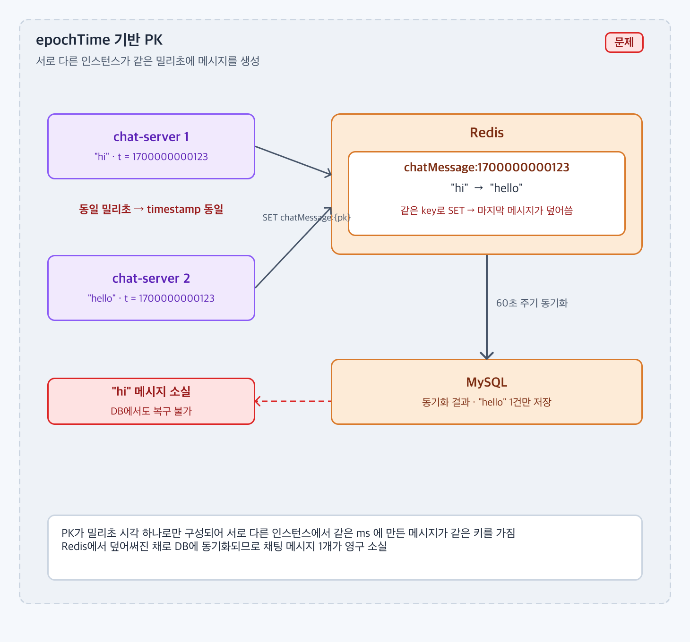
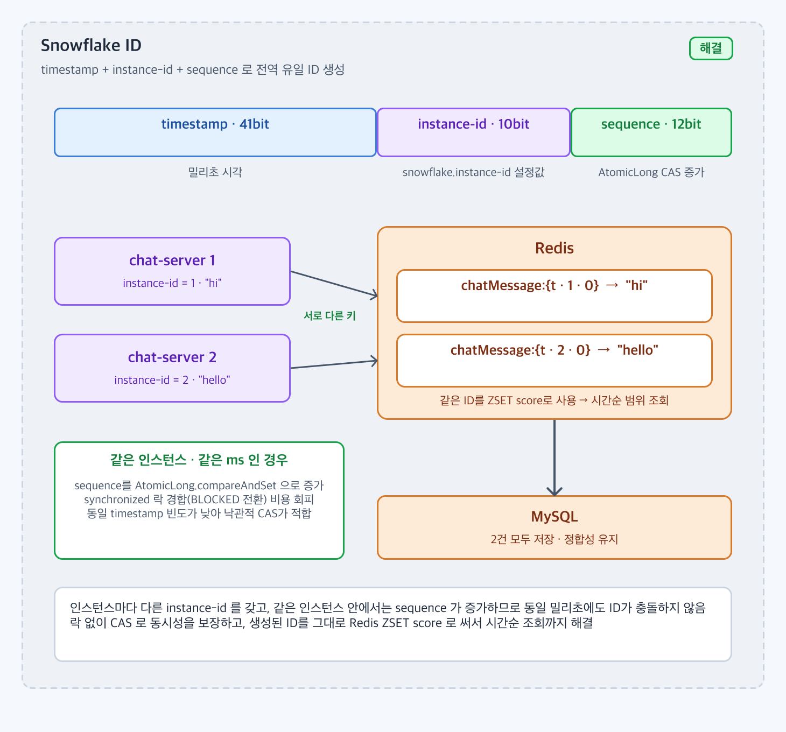

# 분산 환경에서 PK가 중복되어 데이터 정합성이 깨지는 문제를 막으려면 어떤 키 전략을 써야 할까?

## 1. 문제 상황

### 배경

* chat-server 는 auto-scaling 으로 여러 인스턴스가 동시에 뜬다.
* 채팅 메시지는 MySQL 에 바로 쓰지 않고 Redis 에 먼저 저장하고(`chatMessage::{id}`), 60초 스케줄러가 DB 로 옮긴다. 그래서 DB 의 auto-increment 로 PK 를 받을 수 없고, **서버가 스스로 PK 를 만들어야** 한다.
* 채팅방별 메시지 목록은 Redis ZSET(`chatRoom::{roomId}`) 이고 score 가 곧 메시지 ID 다. Long Polling 이 "마지막으로 받은 ID 이후" 를 score 범위로 조회하므로 **ID 가 시간순으로 정렬 가능해야** 한다.

### 문제

* 처음에는 epoch 밀리초를 그대로 PK 로 썼다. 서로 다른 인스턴스, 또는 같은 인스턴스의 동시 요청이 같은 밀리초에 메시지를 만들면 **같은 키** 가 된다.
* Redis `SET` 은 같은 키를 덮어쓰므로 먼저 저장된 메시지가 사라지고, 동기화 시점에는 마지막 메시지 1건만 DB 에 남는다. 사용자는 보낸 메시지가 사라진 것을 보게 된다.
* 채팅 메시지 유실은 서비스 신뢰와 직결되고, DB 에도 없어서 복구 방법이 없다.



두 인스턴스가 같은 밀리초에 만든 메시지가 같은 키로 저장되어 마지막 `SET` 만 남고, 동기화 뒤에는 1건이 사라진다.

---

## 2. 목표 및 제약사항

### 목표

* 인스턴스가 몇 대든, 같은 밀리초에 몇 건이 생기든 **전역 유일** 한 ID 를 만든다.
* ID 가 생성 시각 순으로 **정렬 가능** 해서 ZSET score 로 그대로 쓸 수 있다.
* 생성 시 **DB 나 Redis 왕복이 없고, 락을 잡지 않는다**. 발행 API 의 지연에 ID 생성이 보이지 않아야 한다.

### 제약사항

* 인스턴스 식별자는 설정(`snowflake.instance-id`)으로 부여한다. 별도 coordination 서비스는 두지 않는다.
* ID 를 `long` 하나에 담아 Redis ZSET score(`double`)로 쓴다.
* DB PK 컬럼은 문자열(`chat_message.id`)로 두어 ID 형식 변경에 대비한다.

---

## 3. 해결책 후보 비교

| 후보 | 장점 | 단점 | 프로젝트 적합성 |
| ---- | -- | -- | -------- |
| UUID v4 | 충돌 걱정 없음, 어디서나 생성 | 시간순 정렬 불가, 128비트라 ZSET score 로 못 씀, 인덱스 효율 나쁨 | score 범위 조회가 불가능해 탈락 |
| DB auto-increment / 시퀀스 | 유일성 · 정렬 보장 | 메시지마다 DB 왕복. Redis 먼저 쓰는 구조와 안 맞음 | 발행 경로에 DB 가 끼어들어 탈락 |
| Redis `INCR` | 단순, 유일, 단조 증가 | 매 발행마다 Redis 왕복 1회 추가, Redis 단일 장애점, 시각 정보 없음 | 가능하지만 ID 생성이 네트워크에 묶임 |
| Snowflake (timestamp + instance-id + sequence) | 로컬에서 생성, 시간순 정렬, 인스턴스별로 충돌 없음 | 인스턴스 id 관리 필요, 시계 역행에 취약, 같은 ms 안에서 sequence 동시성 처리 필요 | 채택. 목표 세 가지를 모두 만족 |

`INCR` 도 후보였지만 "발행 지연에 ID 생성이 보이지 않아야 한다" 는 목표 때문에 로컬 생성이 가능한 Snowflake 를 골랐다. 남는 문제는 같은 인스턴스 · 같은 밀리초에서 sequence 를 어떻게 안전하게 증가시키느냐였다.

---

## 4. 최종 의사결정

### 선택한 방법

* **Snowflake ID** 를 `SnowFlakeKeyGenerator` 에서 만든다. `timestamp(ms) · instance-id(10bit) · sequence(12bit)` 를 하나의 `long` 으로 합친다.
* 같은 인스턴스 · 같은 밀리초의 sequence 증가는 `synchronized` 대신 **`AtomicLong.compareAndSet`(낙관적 CAS)** 으로 처리한다.



instance-id 와 sequence 가 붙어 같은 밀리초에도 서로 다른 키가 되고, 같은 ID 가 그대로 ZSET score 로 쓰인다.

### 선택 이유

* instance-id 가 다르면 같은 시각이어도 다른 ID 이므로 인스턴스 간 충돌이 사라진다.
* 같은 인스턴스에서는 sequence 가 증가하므로 같은 밀리초 안에서도 충돌하지 않는다.
* 상위 비트가 timestamp 라 숫자 크기가 생성 시각 순서와 같다. 그대로 ZSET score 로 써서 "ID 이후" 범위 조회를 한다.
* `synchronized` 는 경합 시 스레드가 BLOCKED 로 전환되는 비용이 있다. 같은 밀리초에 충돌하는 빈도가 낮으므로, 실패하면 다시 시도하는 CAS 가 더 싸다.

---

## 5. 구현

* 비트 구성 (`SnowFlakeKeyGenerator.generateSnowFlakeKey`)

```
 result = (timestampMs << 22) | (instanceId << 12) | sequence
          └─ 상위: epoch ms ─┘  └─ 10bit ──┘  └ 12bit ┘
```

* 상태는 `AtomicLong status` 하나에 `(timestamp << 12) | sequence` 로 들고 있다.
  1. `lastStatus = status.get()`
  2. `lastStatus` 의 timestamp 가 지금과 같으면 `sequence + 1`, 다르면 `0`
  3. `status.compareAndSet(lastStatus, timestamp | sequence)` 가 성공할 때까지 반복
* `instance-id` 는 `application.yml` 의 `snowflake.instance-id` 로 인스턴스마다 다르게 준다.
* `ChatService.publish` 가 ID 를 만들어 `chatMessage::{id}` 키와 ZSET member 로 쓰고, `Double.parseDouble(id)` 를 ZSET score 로 넣는다.
* `ChatService.pollingFetch` 는 "현재 시각의 Snowflake ID" 를 상한으로 계산해 `(lastId, now]` 범위를 조회한다.

### 관련 코드

* [SnowFlakeKeyGenerator](https://github.com/jude-z/carrot-repo/blob/dev/chat-server/src/main/java/jude/carrot/chatserver/key/snowflake/SnowFlakeKeyGenerator.java)
* [ChatService.publish / pollingFetch](https://github.com/jude-z/carrot-repo/blob/dev/chat-server/src/main/java/jude/carrot/chatserver/service/ChatService.java)
* [ChatKeyGenerator (Redis 키 형식)](https://github.com/jude-z/carrot-repo/blob/dev/chat-server/src/main/java/jude/carrot/chatserver/key/redis/ChatKeyGenerator.java)
* [application.yml `snowflake.instance-id`](https://github.com/jude-z/carrot-repo/blob/dev/chat-server/src/main/resources/application.yml)
* 시퀀스: [USE_CASE.md 3. 채팅 메시지 전송](../USE_CASE.md#3-채팅-메시지-전송)

> 구현 코드는 본문에 전체를 작성하지 않고 실제 GitHub 코드로 연결한다.

---

## 6. 검증 및 결과

### 검증 방법

* `SnowFlakeKeyGeneratorTest` (단위 테스트)
  * 같은 밀리초에 여러 번 호출해도 서로 다른 키가 나오는지
  * 시간이 지나면 이전보다 큰(정렬 가능한) 키가 나오는지
  * 여러 스레드가 동시에 호출해도 모든 키가 유일한지 (CAS 경합 검증)
  * `instanceId` 가 다르면 같은 시각이어도 다른 키인지
* `ChatServiceTest.publish_success` — 생성된 ID 로 메시지 키와 ZSET member 가 함께 저장되는지
* 부하 테스트(`load-test/locustfile_longpolling.py`)에서 다수 사용자가 동시에 발행할 때 ZSET 에 들어간 메시지 수와 발행 수가 같은지로 유실 여부를 본다.

### 결과

| 지표 | epoch ms PK (기존) | Snowflake (개선 후) |
| ---- | -: | ---: |
| 같은 ms 다중 호출 시 충돌 | 발생 | 0 (단위 테스트 통과) |
| 멀티스레드 동시 호출 시 충돌 | 발생 가능 | 0 (단위 테스트 통과) |
| 인스턴스 2대 같은 시각 충돌 | 발생 | 0 (instance-id 로 구분) |
| ID 생성 시 외부 I/O | 없음 | 없음 (로컬 CAS) |
| 부하 테스트 발행 수 대비 유실 | 측정값 기입 | 측정값 기입 |

---

## 7. 트레이드오프 및 한계

### 트레이드오프

* instance-id 를 설정으로 수동 관리한다. 두 인스턴스에 같은 값을 주면 다시 충돌한다. auto-scaling 에서 자동 할당하려면 별도 장치가 필요하다.
* ID 에 시각이 들어가므로 시계 역행(NTP 보정)에 영향을 받는다. 현재는 역행 감지 로직이 없다.
* `INCR` 방식이었다면 인스턴스 id 나 시계를 신경 쓰지 않아도 됐을 것이다.

### 한계

* **score 정밀도**: ZSET score 가 `double` 이라 53비트 정밀도만 갖는다. ID 는 약 63비트라 하위 약 10비트(sequence 대부분)가 잘린다. 같은 밀리초의 메시지들은 score 가 같아지거나 순서가 바뀔 수 있고, `(lastId, now]` 경계에서 재수신 · 누락이 생길 수 있다. 부하 테스트 클라이언트는 커서를 1ms 앞으로 옮겨 우회한다.
* **sequence 오버플로**: 한 밀리초에 4096건을 넘으면 sequence 가 12비트를 넘어 timestamp 비트를 침범한다. 다음 밀리초까지 대기하는 처리가 없다.
* **epoch**: 1970 기준 밀리초를 22비트 시프트하므로 2039년경 부호 비트에 닿는다. 커스텀 epoch 을 쓰지 않았다.

### 개선 방향

* score 를 ID 그대로 쓰지 않고 `timestamp * 4096 + sequence` 처럼 53비트 안에 들어오는 값으로 압축하거나, ZSET 대신 lexicographic 정렬(`ZRANGEBYLEX`)을 쓴다.
* sequence 가 최대치에 닿으면 다음 밀리초까지 spin-wait 하고, 시계가 역행하면 예외를 던지거나 마지막 timestamp 를 유지한다.
* 커스텀 epoch(예: 프로젝트 시작일)을 두어 사용 가능 기간을 늘린다.
* 인스턴스가 늘어나면 instance-id 를 Redis `INCR` 이나 배포 도구가 자동으로 부여하게 한다.
