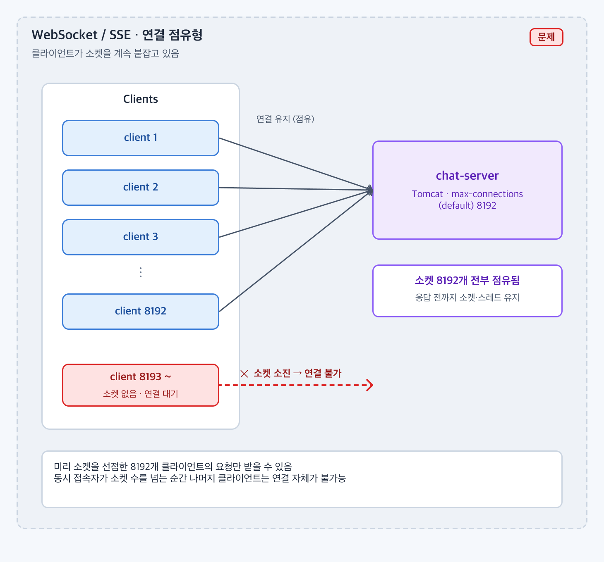
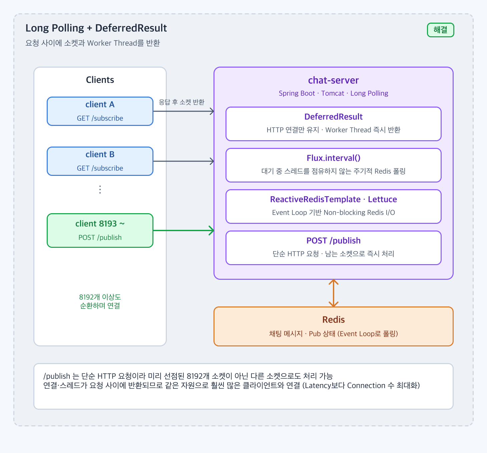

# 고정된 소켓 자원으로 최대한 많은 클라이언트와 연결을 맺으려면 어떤 구조가 적합할까?

## 1. 문제 상황

### 배경

* 1:1 채팅에서 상대가 보낸 메시지를 클라이언트가 바로 받아야 한다. 서버가 밀어주거나, 클라이언트가 서버에 계속 붙어 있어야 한다.
* 이 프로젝트는 서비스 지표를 Latency 보다 **일정 시간 동안 한 인스턴스가 동시에 서비스할 수 있는 클라이언트 수**로 잡았다. 인스턴스 하나가 감당하는 클라이언트 수가 곧 auto-scaling 기준이고 비용이다.
* chat-server 는 Spring MVC + Tomcat 이다. Tomcat 은 `max-connections` 만큼만 소켓을 받고(기본 8192, 이 프로젝트는 `application.yml` 에서 5000), 요청을 처리하는 worker thread 는 기본 200개다.
* 처음 검토한 WebSocket / SSE 는 클라이언트당 소켓 1개를 연결이 끊길 때까지 점유한다.

### 문제

* 연결 점유형에서는 **접속 중인 클라이언트 수 = 점유된 소켓 수** 다. 소켓을 먼저 잡은 클라이언트만 서비스되고, 한도를 넘는 클라이언트는 연결 자체가 거부된다.
* 메시지가 올 때까지 기다리는 동안 worker thread 가 Redis I/O 를 blocking 으로 기다리면, 소켓보다 훨씬 적은 200개의 스레드가 먼저 고갈된다.
* 즉 소켓과 스레드 두 자원 모두 "대기 중인 클라이언트" 에게 묶여 있어서, 실제로 일하는 요청이 들어와도 처리할 자원이 없다.



연결 점유형에서는 소켓을 먼저 잡은 클라이언트만 서비스되고, 그 뒤의 클라이언트는 연결 자체가 거부된다.

---

## 2. 목표 및 제약사항

### 목표

* 같은 인스턴스(소켓 5000, worker thread 200)로 서비스 가능한 동시 클라이언트 수를 최대화한다.
* 정량 목표
  * 대기 중인 클라이언트 수와 무관하게 `tomcat.threads.busy` 가 낮게 유지된다.
  * 같은 부하에서 `chat.clients.active{transport}` 게이지가 연결 점유 방식(WebSocket)보다 더 큰 값에서 포화된다.
* 메시지 수신 지연은 폴링 간격(0.5초) 이내면 허용한다.

### 제약사항

* Spring MVC(Tomcat) 기반을 유지한다. WebFlux 로 전환하지 않는다.
* 인증은 Redis 에 저장된 세션 쿠키를 `api-server` 와 공유한다. 인스턴스 간 연결 공유(스티키 세션, Pub/Sub 브로커)는 두지 않는다.
* 채팅 데이터의 1차 저장소는 Redis 이고, 채팅방별 ZSET 의 score 가 Snowflake ID 라 "마지막으로 받은 ID 이후" 를 범위 조회로 얻을 수 있다.
* 별도 메시지 브로커나 푸시 인프라를 추가하지 않는다.

---

## 3. 해결책 후보 비교

| 후보 | 장점 | 단점 | 프로젝트 적합성 |
| ---- | -- | -- | -------- |
| WebSocket | 양방향, 지연 최소, 프레임 오버헤드 작음 | 클라이언트당 소켓 1개를 연결 내내 점유. 인스턴스가 여러 대면 방별 세션 공유를 위한 브로커가 필요 | 소켓 수 = 클라이언트 수 상한. 지표(연결 수 최대화)와 정반대 |
| SSE | 단방향 push 가 단순, HTTP 그대로 사용 | WebSocket 과 같은 연결 점유 구조. 발행은 별도 HTTP 필요 | WebSocket 과 같은 이유로 부적합 |
| Long Polling + DeferredResult + Reactive Redis | 요청이 끝나면 소켓·스레드가 풀로 돌아감. 대기 중에는 worker thread 를 점유하지 않음. 인스턴스가 늘어도 Redis ZSET 만 공유하면 됨 | 폴링 간격만큼 지연, 빈 응답(타임아웃) 마다 재요청, 매 요청마다 인증·검증 비용 | 채택. 자원을 "요청 사이에" 반환하므로 같은 소켓으로 더 많은 클라이언트를 순환시킬 수 있음 |
| Short Polling | 구현 가장 단순 | 새 메시지가 없어도 요청이 계속 발생. 요청 수 = 클라이언트 수 × 초당 폴링 횟수 | 서버·Redis 부하가 클라이언트 수에 비례해 커짐 |

연결 점유형 두 개는 "소켓을 먼저 잡은 클라이언트만 서비스" 라는 구조 자체가 지표와 맞지 않았다. Long Polling 은 폴링 지연을 감수하는 대신 자원을 요청 사이에 반환하고, DeferredResult 와 Reactive Redis 를 붙이면 대기 중에도 worker thread 를 쓰지 않는다.

---

## 4. 최종 의사결정

### 선택한 방법

* 메시지 수신은 **Long Polling** 으로 한다. `GET /polling-fetch/{chatRoomId}` 가 최대 5초 동안 새 메시지를 기다렸다가 응답한다.
* 요청 스레드는 `DeferredResult` 로 즉시 반환하고, 대기는 `Flux.interval` + `ReactiveRedisTemplate`(Lettuce, event loop) 이 non-blocking 으로 처리한다.
* 메시지 발행 `POST /publish/{chatRoomId}` 는 단순 HTTP 요청이다. Redis 에 쓰고 바로 응답하므로 소켓을 오래 잡지 않는다.



요청이 끝나면 소켓과 worker thread 가 풀로 돌아가고, 대기는 event loop 가 맡는다. `/publish` 는 남는 소켓으로 바로 처리된다.

### 선택 이유

* 소켓과 worker thread 가 "응답 후" 풀로 돌아가므로, 미리 소켓을 선점한 클라이언트가 아니어도 빈 소켓으로 요청이 처리된다. 같은 자원으로 훨씬 많은 클라이언트가 순환하며 연결된다.
* 대기 로직이 event loop 로 넘어가므로 5000개 요청이 대기 중이어도 `tomcat.threads.busy` 는 실제로 응답을 만드는 순간에만 올라간다.
* 모든 인스턴스가 같은 Redis ZSET 을 조회하므로 어느 인스턴스에 붙어도 수신된다. Pub/Sub 이나 세션 공유가 필요 없어 auto-scaling 과 맞다.
* 지연은 폴링 간격 0.5초가 상한이라 채팅 UX 에서 체감되지 않는다.

---

## 5. 구현

* `ChatController.pollingFetch` 는 `DeferredResult<PollingChatMessagesResponse>` 를 5,000ms 타임아웃으로 만들고, `ChatService.pollingFetch` 가 돌려준 `Mono` 를 `subscribe(setResult, setErrorResult)` 한 뒤 즉시 리턴한다. 이 시점에 worker thread 는 풀로 돌아간다.
* `ChatService.pollingFetch`
  * `Flux.interval(0, 500ms).take(4500ms)` 로 0.5초마다 틱을 만든다.
  * 매 틱마다 `(lastChatMessageId, 현재 시각의 Snowflake ID]` 범위로 `chatRoom::{roomId}` ZSET 을 `rangeByScore` 한다. 상한을 틱마다 다시 계산해서 폴링 도중 발행된 메시지를 놓치지 않는다.
  * 결과가 비어 있지 않은 첫 틱에서 `next()` 로 끝내고, `MGET` 으로 본문(`chatMessage::{id}`)을 한 번에 가져와 응답으로 변환한다. 변환은 `Schedulers.parallel()` 에서 한다.
  * 4.5초 안에 메시지가 없으면 Mono 가 비어서 DeferredResult 타임아웃(503)으로 끝난다. 클라이언트는 같은 커서로 다시 요청한다.
* `ChatService.publish` 는 Snowflake ID 를 만들고 `SET chatMessage::{id}` + `ZADD chatRoom::{roomId}` 를 저장한 뒤 바로 응답한다. 상세는 [redis-atomic-rollback](redis-atomic-rollback.md).
* Tomcat `max-connections` 를 5000 으로 두고, Actuator + Micrometer(Prometheus) 로 `tomcat.threads.busy`, `tomcat.connections.current`, `http.server.requests` 히스토그램을 노출한다.
* `ActiveClientTracker` 가 전송 방식별로 최근 30초 안에 활동한 서로 다른 userId 수를 `chat.clients.active{transport=longpolling|websocket}` 게이지로 내보낸다. 부하를 올렸을 때 이 값이 더 이상 늘지 않는 지점이 "동시에 서비스 가능한 최대 클라이언트 수" 다.
* 비교 실험용으로 순수 WebSocket 핸들러(`/ws/chat/{chatRoomId}`)를 같은 서버에 두고 같은 지표를 남기게 했다.

처리 흐름

```
client ── GET /polling-fetch?chatMessageId=last ──▶ Tomcat worker thread
                                                       │ DeferredResult 생성, Mono 구독
                                                       └─ 스레드 즉시 반환
                    event loop: 0.5초마다 ZRANGEBYSCORE chatRoom::{roomId} (last, now]
                          ├─ 비어 있음 → 다음 틱 (최대 4.5초)
                          └─ 있음 → MGET chatMessage::{id}… → deferredResult.setResult
client ◀── 200 {elements:[…]}  또는  503 (타임아웃, 재요청)
```

### 관련 코드

* [ChatController.pollingFetch / publish](https://github.com/jude-z/carrot-repo/blob/dev/chat-server/src/main/java/jude/carrot/chatserver/controller/ChatController.java)
* [ChatService.pollingFetch](https://github.com/jude-z/carrot-repo/blob/dev/chat-server/src/main/java/jude/carrot/chatserver/service/ChatService.java)
* [ActiveClientTracker](https://github.com/jude-z/carrot-repo/blob/dev/chat-server/src/main/java/jude/carrot/chatserver/metrics/ActiveClientTracker.java)
* [비교용 ChatWebSocketHandler](https://github.com/jude-z/carrot-repo/blob/dev/chat-server/src/main/java/jude/carrot/chatserver/websocket/ChatWebSocketHandler.java)
* [application.yml (max-connections, metrics)](https://github.com/jude-z/carrot-repo/blob/dev/chat-server/src/main/resources/application.yml)
* [RedisConfig (ReactiveRedisTemplate)](https://github.com/jude-z/carrot-repo/blob/dev/infra/src/main/java/jude/carrot/infra/config/RedisConfig.java)
* 시퀀스: [USE_CASE.md 4. 메시지 수신](../USE_CASE.md#4-메시지-수신-long-polling)

> 구현 코드는 본문에 전체를 작성하지 않고 실제 GitHub 코드로 연결한다.

---

## 6. 검증 및 결과

### 검증 방법

* 단위 · 통합 테스트
  * `ChatControllerTest.pollingFetch_success` — 폴링 요청이 비동기로 처리되고 완료 후 메시지 목록을 반환하는지 (`MockMvc asyncDispatch`).
  * `ChatServiceTest` — 채팅방 · 참여자 검증 실패 시 예외, 발행 시 Redis 저장 호출.
  * `ActiveClientTrackerTest` — 같은 userId 는 한 번만 세고, window 를 넘긴 항목은 제거되는지.
  * `ChatWebSocketIntegrationTest` — 비교용 WebSocket 경로가 실제로 동작하는지.
* 부하 테스트 (`load-test/`, Locust)
  * `init.sql` 의 `seed_load_test(10000)` 으로 사용자 · 채팅방을 만들고, chat-server · Redis · MySQL · Prometheus 를 띄운다.
  * `locustfile_longpolling.py` — 사용자마다 `/polling-fetch` 를 쉬지 않고 반복하고, 백그라운드에서 `PUBLISH_INTERVAL`(1초) 마다 `/publish`. 503 은 "빈 poll" 로 성공 처리.
  * `locustfile_websocket.py` — 사용자마다 WebSocket 연결 1개 유지, 같은 간격으로 프레임 발행, 브로드캐스트 왕복 시간 기록.
  * 두 스크립트를 같은 `-u`, `-r`, `PUBLISH_INTERVAL` 로 돌리고(`-u 500 -r 50 -t 5m` 부터 단계적으로 증가) Prometheus 에서 아래를 비교한다.

```promql
tomcat_threads_busy_threads
tomcat_connections_current_connections
chat_clients_active{transport="longpolling"}   /  chat_clients_active{transport="websocket"}
histogram_quantile(0.99, sum(rate(http_server_requests_seconds_bucket{uri="/api/v1/chatRoom/polling-fetch/{chatRoomId}"}[1m])) by (le))
histogram_quantile(0.99, sum(rate(http_server_requests_seconds_bucket{uri="/api/v1/chatRoom/publish/{chatRoomId}"}[1m])) by (le))
```

### 결과

* 확인할 것: 부하를 올렸을 때 `chat_clients_active` 가 포화되는 지점(= 최대 동시 클라이언트 수), 그 시점의 `tomcat_threads_busy_threads`, 발행 p99 지연.
* 기대: WebSocket 은 `tomcat_connections_current` 가 `max-connections` 에 닿는 순간 `chat_clients_active` 가 멈춘다. Long Polling 은 소켓이 요청 사이에 반환되므로 같은 지점을 넘어서도 늘어난다.

| 지표 | WebSocket (연결 점유) | Long Polling (개선 후) |
| ---- | -: | ---: |
| 최대 동시 활성 클라이언트 (`chat_clients_active` 포화점) | 측정값 기입 | 측정값 기입 |
| 포화 시점 `tomcat_threads_busy_threads` | 측정값 기입 | 측정값 기입 |
| 발행 p99 (`publish` / `WS publish->broadcast`) | 측정값 기입 | 측정값 기입 |
| 수신 지연 (발행 → 클라이언트 수신) | 측정값 기입 | ≤ 0.5초 + 네트워크 |

> 아직 기록된 측정값이 없다. 위 절차로 측정한 뒤 수치를 채운다.

---

## 7. 트레이드오프 및 한계

### 트레이드오프

* 대기 중인 클라이언트마다 0.5초에 한 번 `ZRANGEBYSCORE` 가 나간다. Redis 읽기 부하가 클라이언트 수 × 2 req/s 로 늘어난다. push 방식이었다면 발행 시에만 I/O 가 발생했을 것이다.
* 빈 poll 은 5초마다 503 으로 끝나고 클라이언트가 재요청한다. 클라이언트에 재연결 · 커서 관리 로직이 필요하고, 커넥션 churn 이 생긴다.
* 매 폴링 요청마다 세션 인증과 채팅방 · 참여자 존재 확인(캐시)이 반복된다. WebSocket 은 핸드셰이크 한 번으로 끝난다.
* 수신 지연 상한이 0.5초로, 진짜 push 보다는 느리다.

### 한계

* 소켓은 폴링이 대기하는 4.5초 동안은 여전히 점유된다. 반환되는 건 스레드이고, 소켓은 "요청 사이에" 순환할 뿐이라 상한이 사라지는 것은 아니다.
* ZSET score 가 `double` 이라 Snowflake ID(약 63비트)의 하위 비트가 잘린다. 같은 밀리초에 여러 메시지가 있으면 `(last, now]` 경계에서 같은 메시지를 다시 받거나 놓칠 수 있어, 부하 테스트 클라이언트는 커서를 1ms 앞으로 옮겨 우회한다. 상세는 [distributed-id-snowflake](distributed-id-snowflake.md).
* 새 메시지가 없는 방도 계속 폴링하므로, 방 수가 많고 조용한 서비스에서는 낭비가 크다.

### 개선 방향

* 폴링 대신 Redis Pub/Sub 이나 keyspace notification 으로 "발행됨" 이벤트를 받아 DeferredResult 를 완료시키면, 대기 중 Redis 읽기를 없앨 수 있다.
* 클라이언트에 빈 poll 이 반복될 때 backoff 를 두고, 활성 방만 짧게 폴링한다.
* 부하 테스트 결과를 바탕으로 `max-connections`, DeferredResult 타임아웃, 폴링 간격을 튜닝한다.
* 규모가 커지면 WebFlux 로 전환해 소켓까지 event loop 가 관리하게 하거나, 연결을 전담하는 게이트웨이를 분리한다.
