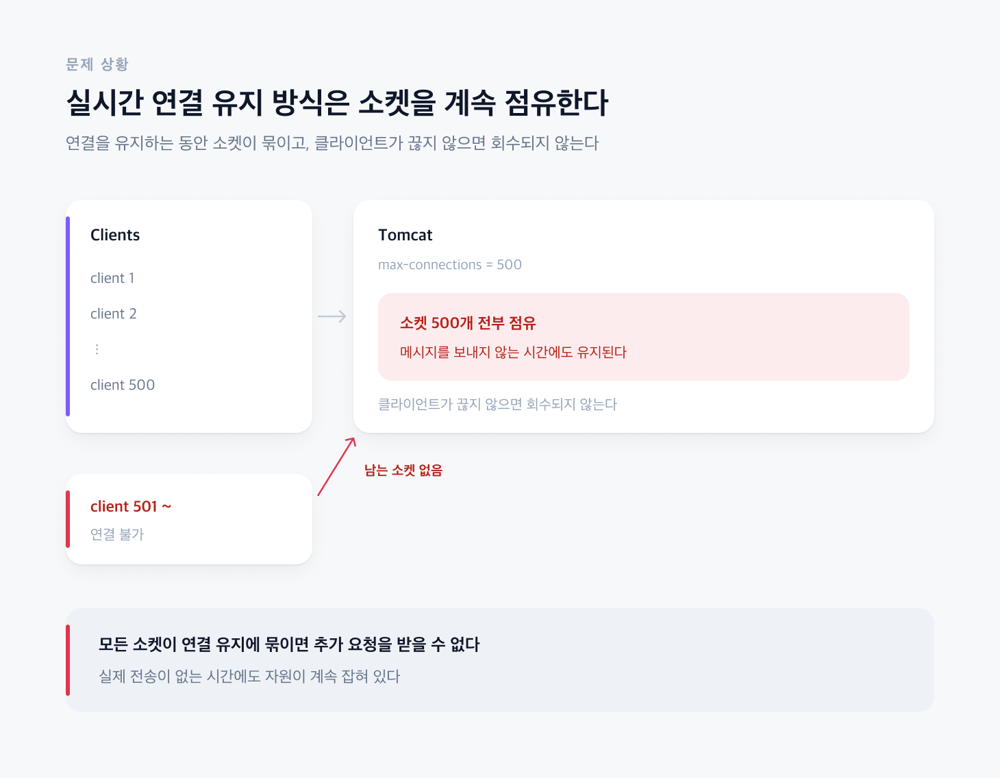
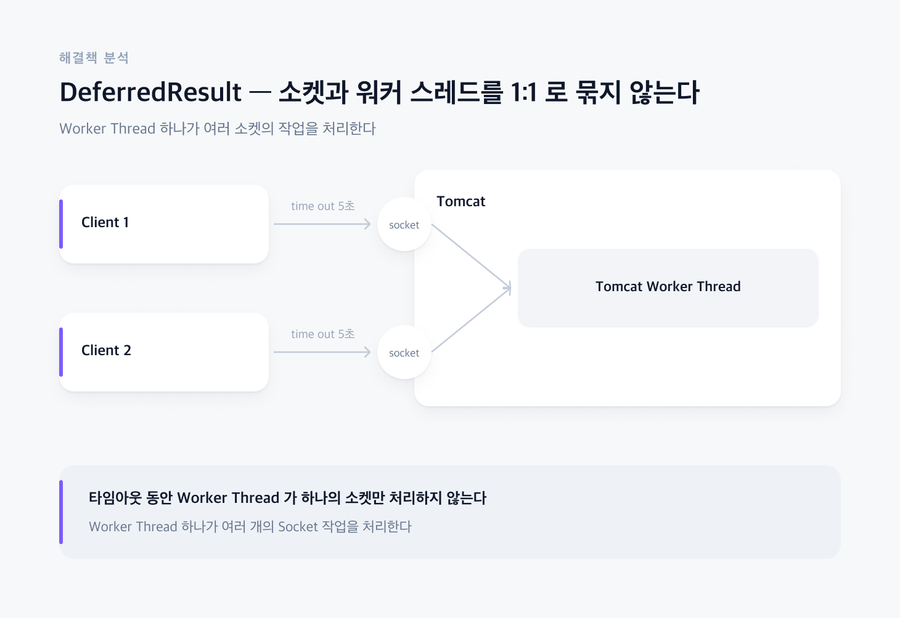
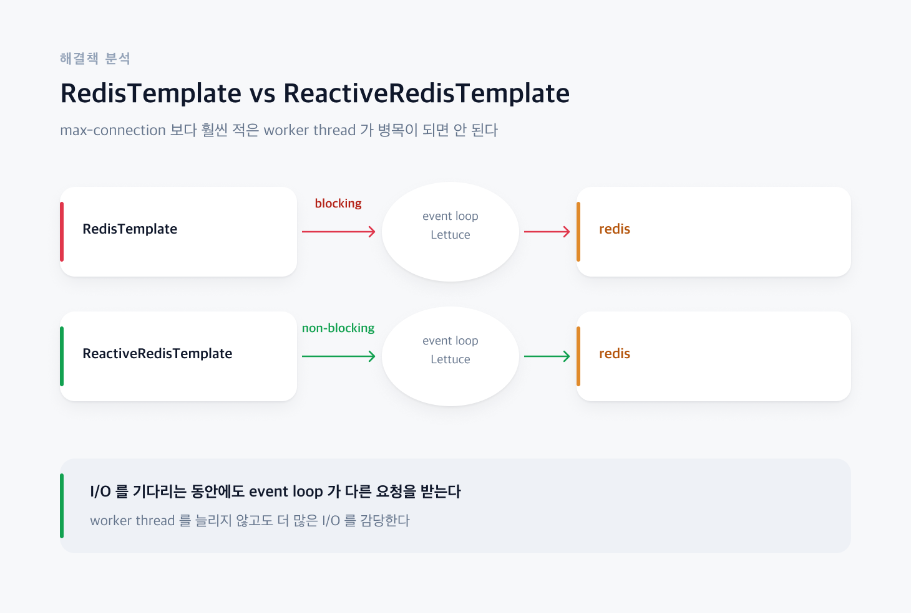
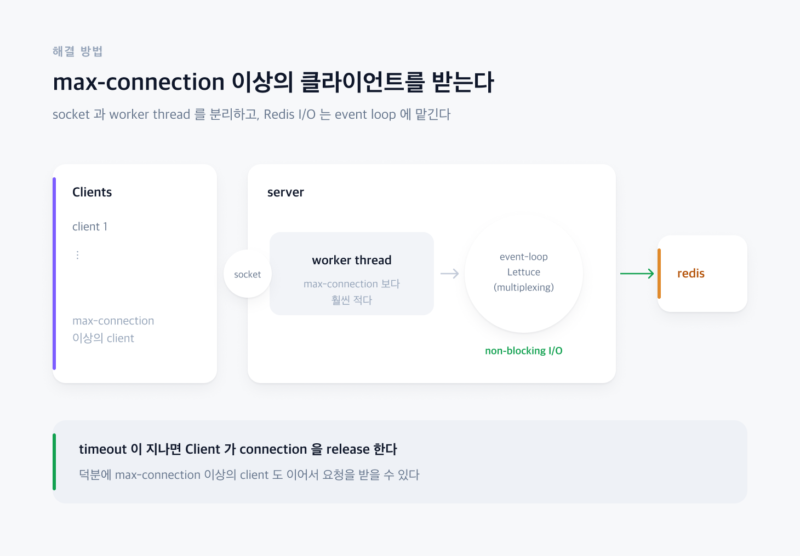
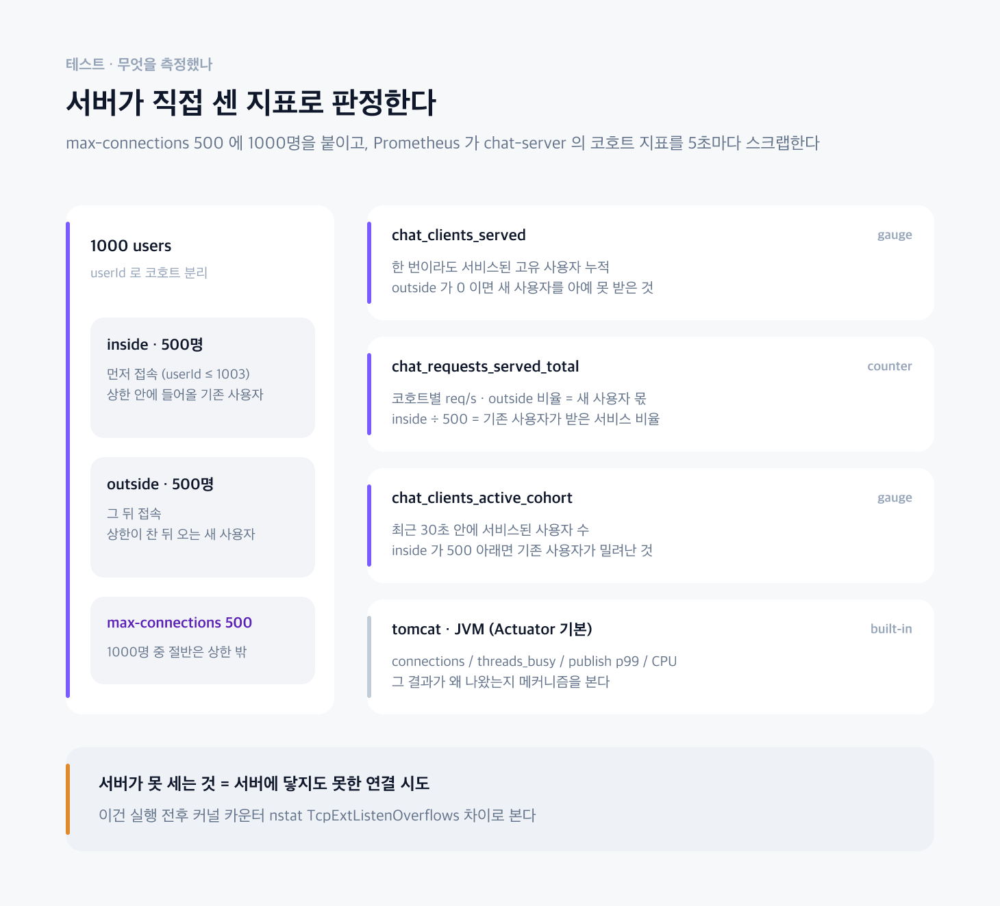
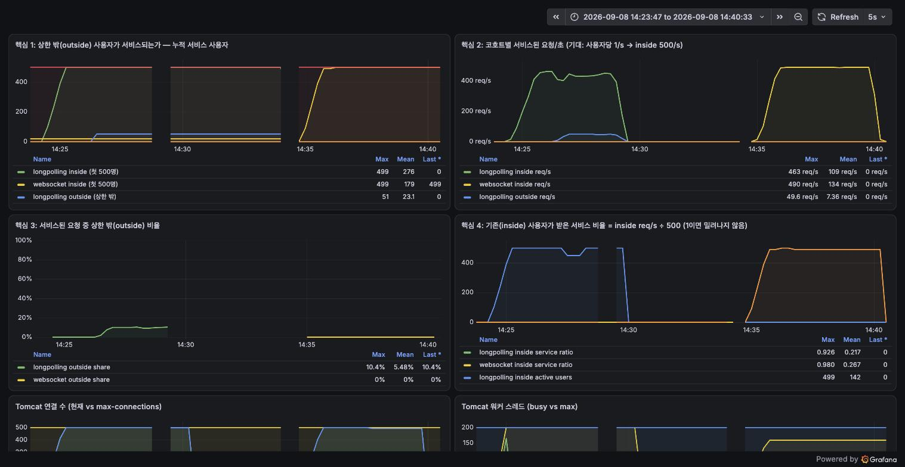

# 한정된 소켓수로 최대한 다양한 클라이언트의 처리를 받기 위해서는 어떤 구조가 적합할까?

## 1. 문제 상황

### [ 한정된 소켓 자원 ]

웹 서버(Tomcat)는 한정된 소켓자원으로 최대한 많은 클라이언트와의 요청을 처리해야한다. 그 뿐만 아니라, 클라이언트가 커넥션을 끊는다는 요청을 하지 않는다면 리소스(소켓)이 제 떄 정리안될 상황이 존재한다. 

### [ 실시간 연결 유지]

WebSocket, SSE같은 실시간 연결 유지 통신 방식은 실제로 메세지를 전송하지 않지만, 연결을 유지해야 한다.
즉, 서버는 메세지를 전송하지 않는 시간대에 다른 클라이언트와의 요청을 처리할 수 없다.(실시간 연결을 유지해야 하므로)
그 뿐만 아니라, 모든 소켓이 실시간 연결을 유지하고 있다면 추가적인 Client의 요청을 처리할수가 없다.

## 2. 해결책 분석

### [Long Polling]

채팅 서버를 고려하였을 떄, Client가 메세지를 publish할 떄, 상대방을 클라이언트가 정확히 몇 초전에 메세지를 보냈는지 알지를 못한다.
즉, 채팅서버를 구현할 때, Latency가 중요한 지표인 점은 맞지만, 얼마나 다양한 Client의 요청을 처리할 수 있나?(Throughput 지표)를 더 중요하게 고려하였다.
유저 입장에서는 상대방이 100ms전에 메세지를 보냈는지, 200ms 메세지를 보냈는지 관심이 없다. Latency의 상항선만 넘지 않으면 크게 고려해야할 지표는 아니다.
따라서 채팅 메세지를 발행하는 것은 단순히 HTTP 통신으로 고려하였다.
실시간으로 채팅 메세지를 조회할 경우에는 주기적으로 특정 시각(500ms)마다 Redis를 조회하여 추가적으로 등록된 채팅 메세지가 있는지 확인한다.

### [Callable vs DeferredResult]

Long-polling 시 , 하나의 Client가 무작정 소켓을 계속 점유 할수 없기 때문에 타임아웃을 5s로 설정하였다. 
그 뿐만 아니라, 무한정 채팅 메세지를 조회할 것이 아니고, 특정 주기마다 메세지를 조회해야한다. 따라서, 추가된 메세지가 있을 경우에는 메세지를 전달하면 되지만 
메세지가 없다고 해서 바로 커넥션을 종료하면안된다. 즉, 타임아웃까지는 통신을 유지해야한다. 그 뿐만 아니라, 실제로 특정 주기마다 조회 요청(I/O) 때문에 그 스레드가 계속 점유하고 있을 수가 없다.
스레드를 실제로 사용하지 않는 시간이 훨씬 많기 때문이다. 따라서 톰켓 워커 스레드와 I/O 처리를 담당하는 스레드를 분리해야한다.
스프링에서는 비동기 처리와 관련하여 Callable, DeferredResult 두개를 지원한다. 
지금 상황에서의 목적은 톰캣 스레드는 다른 요청을 처리할 수 있도록 하면서, 클라이언트는 타임아웃동안 커넥션을 유지해야하는 상황이다.
어차피 최대한 많은 수의 I/O를 처리하기 위해 Non-Blocking으로 할 예정이며, Callable를 쓰게 된다면 하나의 스레드에서도 처리해야 될 문제를 굳이 스레드를 여러개 생성하게 된다면, 
결국 스레드 리소스(메모리) 낭비 이므로, DeferredResult를 채택하였다.

### [RedisTemplate vs ReactiveRedisTemplate]

RedisTemplate, ReactiveRedisTemplate 모두 Lettuce를 사용할 수 있지만, ReactiveRedisTemplate는 Netty 이벤트 루프 방식의 Non-Blocking의 방식의 I/O를 사용하므로,
최대한 많은 I/O를 담당할 수 있다.(I/O를 기다리는동안 스레드가 쉬지 않는다) 따라서 ReactiveRedisTemplate를 선택하기로 하였다.

## 3. 해결 방법

### [ Long Polling + DeferredResult + Reactive Redis ]

### [ 테스트 ]

Tomcat 의 max-connection 을 500 으로 두고 VU 를 1000 까지 올렸다. 상한 밖 500명은 앉을 자리가 없는 상태다.
같은 조건(1000명, 10명/초 램프업, 사용자당 1초에 1건 발행, 5분)에서 발행 방식만 HTTP publish 와 WebSocket 으로 바꿔가며 두 번 돌렸다.

판정은 Locust 가 기록한 클라이언트 성공률이 아니라 서버가 직접 세는 Prometheus 지표로 했다.
userId 로 사용자를 inside(먼저 온 500명) / outside(상한이 찬 뒤 온 500명) 로 나누고, 코호트별로 누가 얼마나 서비스됐는지를 센다.

결과. 왼쪽이 HTTP publish, 오른쪽이 WebSocket 이다.

| 핵심 지표 | HTTP publish | WebSocket |
|---|---|---|
| 상한 밖 사용자 누적 (`chat_clients_served` outside) | 51명 | 0명 |
| 상한 밖 요청 비율 (outside ÷ 전체) | 9.9% | 0% |
| 기존 사용자 서비스 비율 (inside req/s ÷ 500) | 0.78 | 0.96 |
| 발행 p99 | 890ms | 130ms |

WebSocket 은 먼저 들어온 사용자가 연결을 놓지 않으므로 상한 밖 사용자가 한 명도 들어오지 못한다(outside 0). 대신 들어온 사용자는 온전히 서비스된다.
HTTP publish 는 keep-alive 연결이 100 요청마다 닫히며 생기는 틈으로 새 사용자가 들어와 전체 처리의 9.9% 를 가져간다. 그 대가로 먼저 온 500명이 기대치의 78% 만 받고 p99 가 890ms 까지 늘어난다.

즉 이 이슈의 목적(한정된 소켓으로 최대한 다양한 클라이언트를 받는다)대로 동작한다. 다만 전원이 느려지는 형태로 대가를 치르므로, 앞에서 말한 Latency 상한선을 넘지 않는지 함께 봐야 한다.

> 실험 환경, 시나리오, 전체 지표와 원본 데이터는 [WebSocket vs Long Polling 부하 테스트](../load-test/websocket-vs-longpolling.md) 에 정리했다.

## 4. 관련 코드

* [ChatController](https://github.com/jude-z/carrot-repo/blob/main/chat-server/src/main/java/jude/carrot/chatserver/controller/ChatController.java) - 
* [ChatService](https://github.com/jude-z/carrot-repo/blob/main/chat-server/src/main/java/jude/carrot/chatserver/service/ChatService.java) - `Flux.interval` 로 ZSET 을 주기 조회하는 폴링 로직
* [RedisConfig](https://github.com/jude-z/carrot-repo/blob/main/infra/src/main/java/jude/carrot/infra/config/RedisConfig.java) - `ReactiveRedisTemplate` 설정
* [ChatControllerTest](https://github.com/jude-z/carrot-repo/blob/main/chat-server/src/test/java/jude/carrot/chatserver/controller/ChatControllerTest.java)
* [ChatServiceTest](https://github.com/jude-z/carrot-repo/blob/main/chat-server/src/test/java/jude/carrot/chatserver/service/ChatServiceTest.java)
