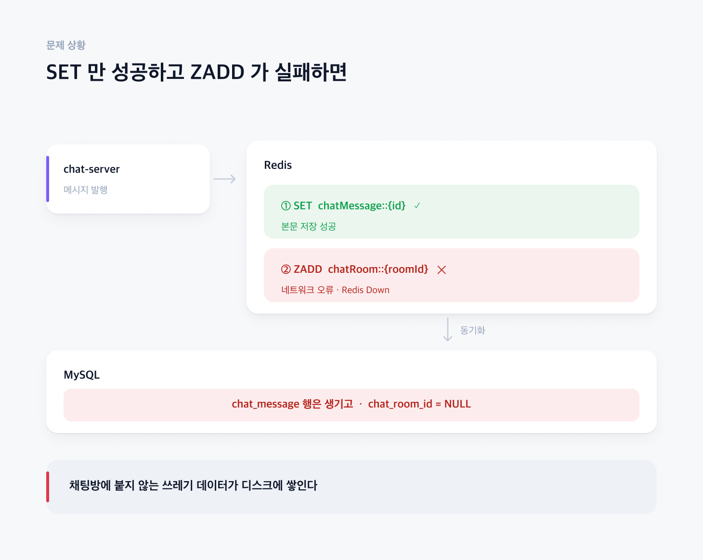
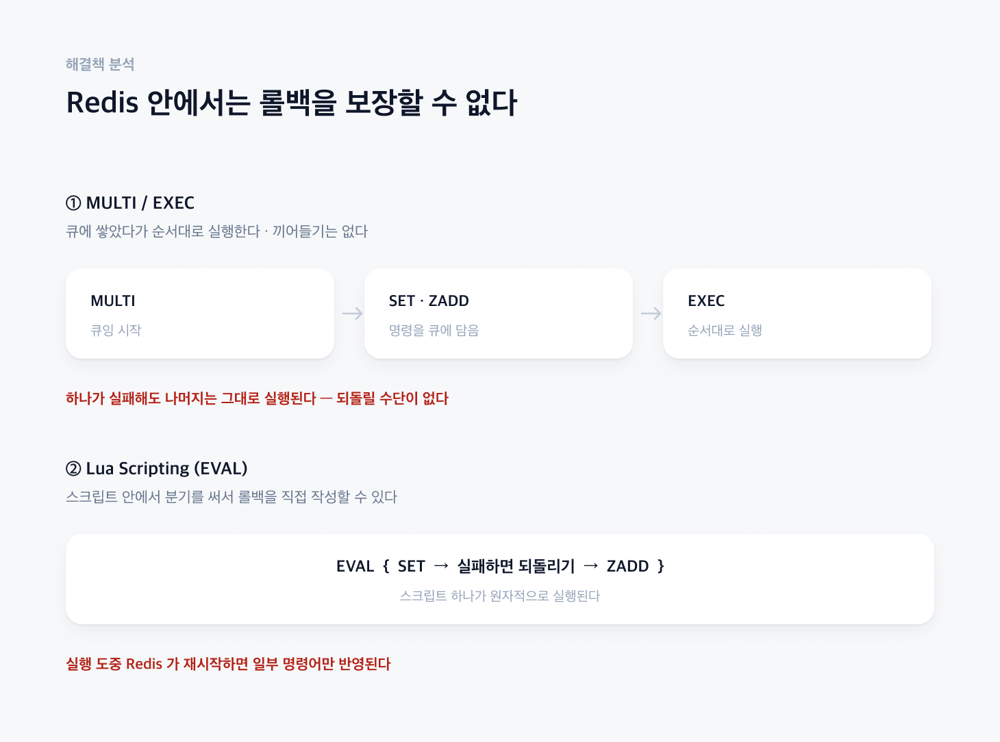
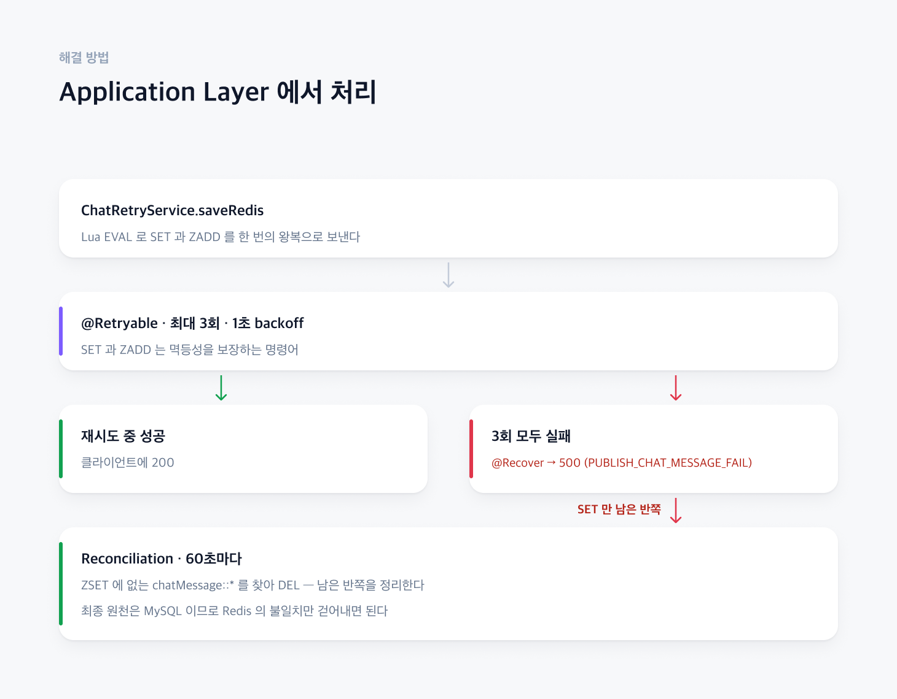

# 두 개의 Command를 하나의 트랜잭션으로 처리하고 싶을 때 어떻게 해야할까?

메시지 발행은 Redis에 두개의 데이터를 저장한다. 채팅메세지를 `SET` 하고 채팅방 목록에 채팅메세지 FK를 `ZADD` 한다. 
둘 다 성공해야 Client에 200을 내려줄수 있다.(일부만 성공할 경우에는 성공이라고 볼 수 없다.)

## 1. 문제 상황

### [ 하나만 성공하면 ]

네트워크 오류, Redis Down등의 원인으로 인하여 SET 명령어만 성공 할 수 있다.
동기화까지 된다면, DB입장에서는 결국 채팅 메세지 테이블에만 데이터가 저장되고, 채팅방에 해당하는 FK가 NULL인 상태로 된다.
즉, 의미없는 쓰레기 데이터만 계속 디스크에 쌓이게 된다.
따라서 일부 명령어 성공에 대한 후처리가 필요하다.

## 2. 해결책 분석

### [ MULTI/EXEC ]

두 명령어로 묶기 위하여 MULTI/EXEC를 고려해 보았지만, Redis의 트랜잭션 기능은 두 명령어를 원자적으로 실행된다는 것을 보장할 뿐이지 롤백 기능을 보장하지 못한다.
즉, 일부 명령어만 실패할 경우도 여전히 존재한다.

### [ Lua Scripting ]

MULTI/EXEC와 다르게 Eval명령어로 일부 명령어가 실패할 경우에 분기로직을 작성하여 Rollback기능을 직접 스크립트에 작성할 수 있다.
하지만, 일부 명령어만 수행 후, 다시 Redis가 재시작 하게 된다면 일부 명령어에 대한 처리만 완료 된 상태이기 때문에 정확히 롤백 기능을 스크립트로 활용할 수 없다.

## 3. 해결 방법

### [ Application Layer에서 처리 ]
결국 Redis에서 자체적인 롤백 기능을 제공하지 않기 때문에 서버단에서 처리해야한다고 결론 지었다. 지금 일부 명령어만 성공한 상황(SET만 성공)에는 Retry로 여러번 수행해도 멱등성을 보장한다.
따라서 Retry 해도 문제가 없다고 판단하였다. 최악의 경우에 Retry가 실패할 경우에는 500 에러를 전달하기로 하였다.(Recover로직)
하지만, 결국 Retry가 실패할 경우에는 SET만 성공하고, ZADD만 실패할 경우이므로, 레디스 관점에서 데이터 정합성 불일치가 발생한다.
최종 데이터의 원천을 DB로 잡았기 때문에 Redis에서 데이터 정합성 불일치 빈도를 고려하여(아주 희박) Reconciliation 기능을 개발하였다.

Reconciliation 로직 : ZSET에는 존재하지 않고, SET에만 존재하는 데이터를 제거하는 기능

## 4. 관련 코드

* [ChatRetryService](https://github.com/jude-z/carrot-repo/blob/main/chat-server/src/main/java/jude/carrot/chatserver/service/ChatRetryService.java) - Lua 스크립트로 `SET` + `ZADD` 를 한 번에, `@Retryable` 3회, `@Recover`
* [RetryConfig](https://github.com/jude-z/carrot-repo/blob/main/chat-server/src/main/java/jude/carrot/chatserver/config/RetryConfig.java) - `@EnableRetry`
* [ChatScheduler](https://github.com/jude-z/carrot-repo/blob/main/chat-server/src/main/java/jude/carrot/chatserver/scheduler/ChatScheduler.java) - `reconciliation` 을 60초마다 실행 (`@Scheduled`, `@SchedulerLock`)
* [ChatRetryServiceTest](https://github.com/jude-z/carrot-repo/blob/main/chat-server/src/test/java/jude/carrot/chatserver/service/ChatRetryServiceTest.java) - 스크립트 인자 검증, 재시도 3회 후 `@Recover` 진입 검증
