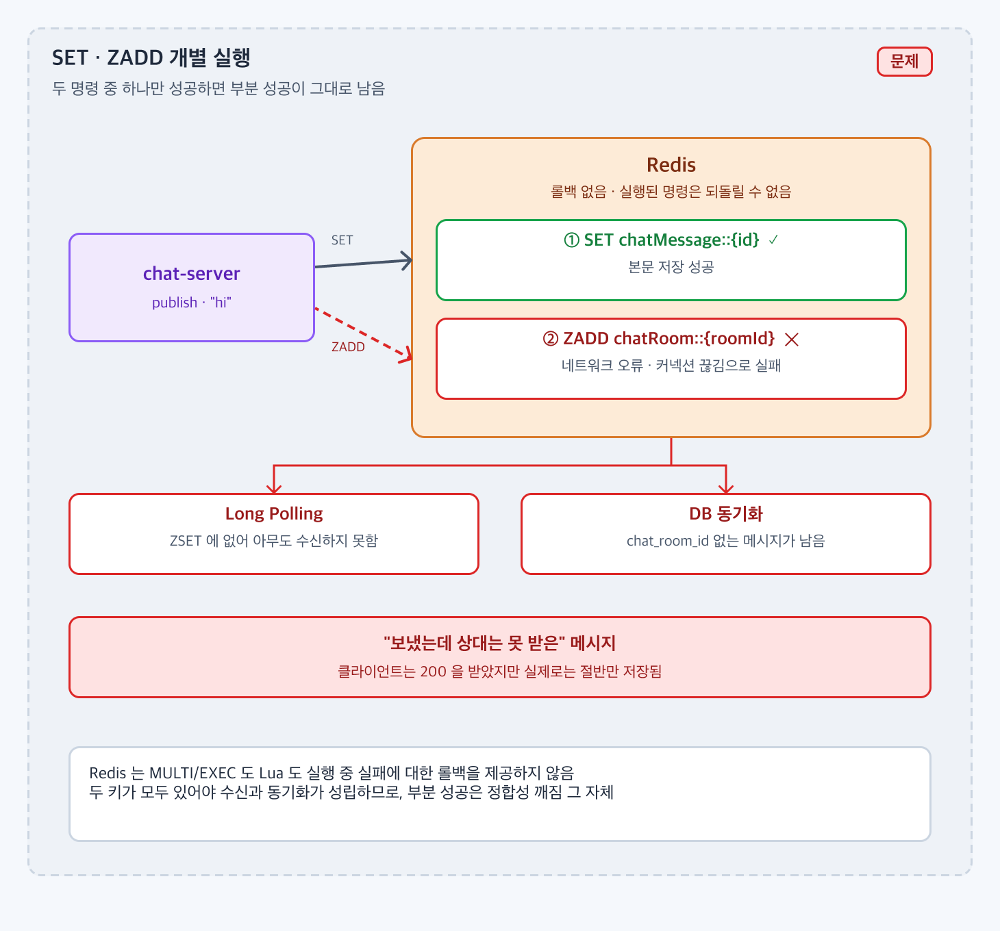
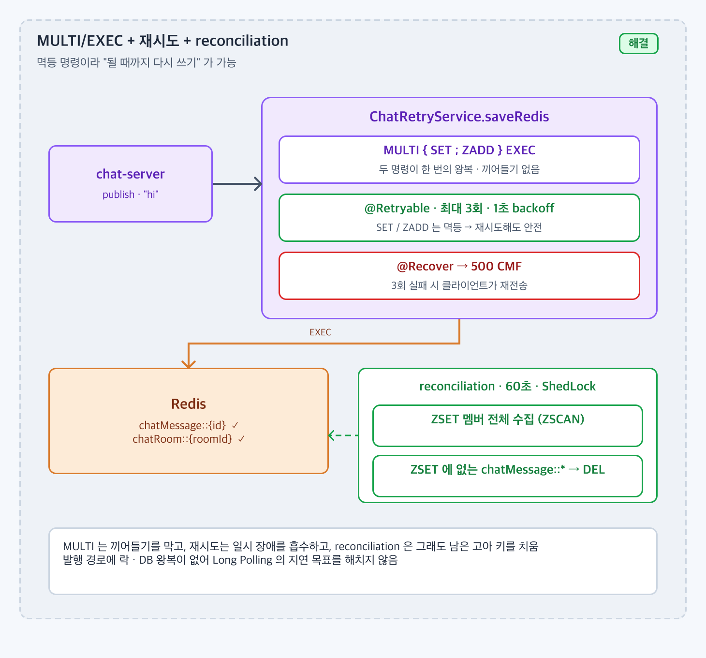

# Redis에서 두 개 이상의 명령을 원자적으로 수행하려 할 때, 데이터 정합성을 어떻게 지킬까?

## 1. 문제 상황

### 배경

* 메시지 발행(`ChatService.publish`)은 Redis 에 두 가지를 쓴다.
  * `SET chatMessage::{id}` — 메시지 본문
  * `ZADD chatRoom::{roomId} score={id} member={id}` — 채팅방별 메시지 목록
* Long Polling 은 ZSET 을 범위 조회한 뒤 `MGET` 으로 본문을 읽고, 동기화 스케줄러는 두 키를 각각 SCAN 해서 DB 로 옮긴다. **둘 다 있어야** 수신도 동기화도 성립한다.

### 문제

* 네트워크 오류, 커넥션 끊김, Redis 재시작 등으로 두 명령 중 하나만 성공할 수 있다.
  * `SET` 만 성공: 본문은 있는데 방 목록에 없음. 아무도 수신하지 못하고 DB 에는 `chat_room_id` 없는 메시지가 남는다.
  * `ZADD` 만 성공: 목록에는 있는데 본문이 없음. 폴링의 `MGET` 이 `null` 을 돌려주고 응답 변환에서 실패한다.
* Redis 는 **롤백이 없다**. `MULTI/EXEC` 는 큐에 쌓인 명령을 중간에 끼어들지 않고 실행할 뿐, 한 명령이 실패해도 나머지는 실행된다. Lua 스크립트도 중간에 실패하면 앞의 쓰기가 남는다.
* 부분 성공이 남으면 사용자는 "보냈는데 상대는 못 받은" 메시지를 보게 된다.



`SET` 만 성공하고 `ZADD` 가 실패하면 본문은 있는데 방 목록에는 없는 메시지가 남는다. Redis 는 이를 되돌려 주지 않는다.

---

## 2. 목표 및 제약사항

### 목표

* 일시적 장애에서는 부분 성공 상태를 남기지 않고 발행을 완료한다.
* 끝내 실패하면 클라이언트에 명확한 실패 응답을 주고, 남은 부분 성공 데이터는 나중에라도 정리한다.
* 발행 경로에 락이나 DB 왕복을 추가하지 않는다.

### 제약사항

* Redis 는 트랜잭션 롤백을 제공하지 않는다. 정합성은 Application 계층에서 맞춰야 한다.
* `SET` 과 `ZADD` 는 **멱등** 이다. 같은 값으로 다시 실행해도 결과가 같다. 이 성질을 재시도에 이용할 수 있다.
* 현재 Redis 는 단일 노드다. Cluster 로 가면 `chatMessage::{id}` 와 `chatRoom::{roomId}` 가 다른 슬롯에 놓여 `MULTI` 로 묶을 수 없다.
* Spring Data Redis(`RedisTemplate`, Lettuce) 를 그대로 쓴다.

---

## 3. 해결책 후보 비교

| 후보 | 장점 | 단점 | 프로젝트 적합성 |
| ---- | -- | -- | -------- |
| `MULTI/EXEC` 트랜잭션 | 두 명령 사이에 다른 클라이언트가 끼어들지 못함. 큐 전송 실패 시 둘 다 실행 안 됨 | 실행 중 한 명령이 실패해도 롤백 없음. Cluster 에서 다른 슬롯 키 불가 | 원자적 "전송" 은 보장하지만 롤백은 아님. 재시도와 함께 써야 함 |
| Lua 스크립트 | 서버에서 하나의 단위로 실행 | 중간 실패 시 롤백 없음, 스크립트 관리 필요, Cluster 슬롯 제약 동일 | `MULTI` 대비 이점이 크지 않음 |
| Pipeline | 왕복 감소 | 원자성 없음 (명령이 각각 실행됨) | 정합성 목적에는 부적합 |
| Application 재시도 (`@Retryable`) + 실패 응답 | 멱등 명령이라 재시도가 안전. 일시 장애를 흡수 | 재시도 후에도 실패하면 부분 성공이 남을 수 있음 | 채택. 단, 남은 부분 성공을 치우는 장치가 추가로 필요 |
| 주기적 reconciliation (고아 정리) | 어떤 경로로 부분 성공이 남아도 결국 정리됨 | 즉시성이 없음, 스케줄러 부하 | 채택. 재시도의 빈틈을 메움 |

한 가지로는 부족했다. `MULTI` 는 끼어들기를 막고, 재시도는 일시 장애를 흡수하고, reconciliation 은 그래도 남은 고아를 치운다.

---

## 4. 최종 의사결정

### 선택한 방법

* `SET` + `ZADD` 를 **`MULTI/EXEC`** 로 묶어 한 번에 보낸다 (`ChatRetryService.saveRedis`, `SessionCallback`).
* 이 메서드에 **`@Retryable`** 을 붙여 실패 시 최대 3회 재시도하고, `@Recover` 에서 `CustomException(PUBLISH_CHAT_MESSAGE_FAIL, 500)` 을 던져 클라이언트에 실패를 알린다.
* 60초마다 도는 **reconciliation** 작업이 어떤 ZSET 에도 없는 `chatMessage::{id}` 키(SET 만 성공한 고아)를 찾아 삭제한다.



`MULTI` 로 한 번에 보내고, 실패하면 재시도하고, 그래도 남은 고아 키는 reconciliation 이 치운다.

### 선택 이유

* `SET`, `ZADD` 가 멱등이므로 재시도로 상태가 이상해질 일이 없다. 롤백 대신 "될 때까지 다시 쓰기" 가 가능한 이유다.
* `MULTI/EXEC` 로 두 명령이 하나의 왕복으로 나가므로, 전송 단계 장애에서는 둘 다 실행되지 않아 부분 성공 자체가 줄어든다.
* 재시도까지 실패하면 500 을 돌려주므로 클라이언트가 "보내지지 않았다" 를 알고 다시 보낼 수 있다.
* 그래도 남은 고아 키는 reconciliation 이 치우므로 DB 에 `chat_room_id` 없는 메시지가 쌓이지 않는다.
* 발행 경로에 락 · DB 왕복이 없어 Long Polling 구조의 지연 목표를 해치지 않는다.

---

## 5. 구현

* `ChatRetryService.saveRedis(chatMessageKey, chatRoomMessageKey, message, member, score)`
  * `redisTemplate.execute(SessionCallback)` 안에서 `multi()` → `SET` → `ZADD` → `exec()`.
  * `@Retryable` (기본 3회, 1초 backoff) · `@Recover(RedisException)` 에서 로그 후 `CustomException(PUBLISH_CHAT_MESSAGE_FAIL)`.
  * `RetryConfig` 의 `@EnableRetry` 로 프록시가 적용된다. 재시도 대상 메서드는 별도 빈에 두어 self-invocation 문제를 피했다.
* `ChatService.publish` 는 채팅방 · 참여자 존재를 캐시로 확인하고 Snowflake ID 를 만든 뒤 `chatRetryService.saveRedis` 를 호출한다.
* `ChatSyncService.reconciliation` (`ChatScheduler`, 60초, ShedLock)
  1. 모든 `chatRoom::*` ZSET 을 `SCAN` + `ZSCAN` 해서 살아 있는 메시지 ID 집합을 만든다.
  2. `chatMessage::*` 를 `SCAN` 하면서 집합에 없는 키를 모아 1,000건 단위로 `DEL` 한다.
* 실패 응답: `{"code":"CMF","detailMessage":"push chat message fail"}`, HTTP 500.

```
publish ─▶ MULTI { SET chatMessage::{id} ; ZADD chatRoom::{roomId} } EXEC
              │ 실패 → 1초 후 재시도 (최대 3회)
              └ 3회 실패 → @Recover → 500 CMF
60초마다 reconciliation ─▶ ZSET 에 없는 chatMessage::* → DEL
```

### 관련 코드

* [ChatRetryService](https://github.com/jude-z/carrot-repo/blob/dev/chat-server/src/main/java/jude/carrot/chatserver/service/ChatRetryService.java)
* [RetryConfig](https://github.com/jude-z/carrot-repo/blob/dev/chat-server/src/main/java/jude/carrot/chatserver/config/RetryConfig.java)
* [ChatService.publish](https://github.com/jude-z/carrot-repo/blob/dev/chat-server/src/main/java/jude/carrot/chatserver/service/ChatService.java)
* [ChatSyncService.reconciliation](https://github.com/jude-z/carrot-repo/blob/dev/chat-server/src/main/java/jude/carrot/chatserver/service/ChatSyncService.java)
* [Status.PUBLISH_CHAT_MESSAGE_FAIL](https://github.com/jude-z/carrot-repo/blob/dev/service/src/main/java/jude/carrot/service/status/Status.java)
* 시퀀스: [USE_CASE.md 3. 채팅 메시지 전송](../USE_CASE.md#3-채팅-메시지-전송)

> 구현 코드는 본문에 전체를 작성하지 않고 실제 GitHub 코드로 연결한다.

---

## 6. 검증 및 결과

### 검증 방법

* `ChatServiceTest.publish_success` — 발행 시 `ChatRetryService` 를 통해 메시지 키와 ZSET member 가 함께 저장되는지.
* `ChatSyncServiceTest`
  * `reconciliation: zset에 없는 chatMessage 키만 삭제한다`
  * `reconciliation: 고아 키가 없으면 삭제하지 않는다`
* 장애 시나리오 (수동): 발행 중 Redis 를 내렸다 올려 재시도로 복구되는지, 계속 내려 두면 3회 후 `CMF` 500 이 오는지 확인한다.
* 부하 테스트에서 `POST /publish` 실패율과 발행 수 대비 ZSET member 수 · `chatMessage` 키 수 차이(고아 수)를 본다.

### 결과

| 지표 | 개별 명령 (기존) | MULTI + 재시도 + reconciliation (개선 후) |
| ---- | -: | ---: |
| 일시 장애 시 발행 성공 | 즉시 실패 | 3회 재시도로 복구 |
| 재시도 후 실패 시 클라이언트 응답 | 부분 성공인데 200 | 500 `CMF` |
| 고아 `chatMessage` 키 잔존 | 영구 잔존 | 60초 내 정리 (단위 테스트 통과) |
| 부하 테스트 발행 실패율 | 측정값 기입 | 측정값 기입 |

---

## 7. 트레이드오프 및 한계

### 트레이드오프

* 재시도 3회 × 1초 backoff 라 최악의 경우 발행 응답이 3초 이상 걸린다. Long Polling 의 지연 목표와 충돌할 수 있다.
* reconciliation 이 60초마다 모든 ZSET 과 `chatMessage` 키를 훑는다. 키가 많아지면 Redis 읽기 부하가 된다.
* Lua 스크립트였다면 "ZADD 성공 여부에 따라 SET 을 되돌리는" 보상 로직을 서버에서 한 번에 처리할 수 있었다.

### 한계

* `@Recover` 가 `RedisException` 만 받는다. 직렬화 오류 등 다른 예외는 재시도 후 그대로 전파된다.
* `ChatService` 안에 private `@Retryable saveRedis` 가 남아 있다. private 메서드는 프록시가 적용되지 않으므로 죽은 코드이고 정리해야 한다.
* reconciliation 은 "ZSET 에 없으면 고아" 로 판단한다. 동기화 작업이 ZSET 을 먼저 DB 에 반영하고 삭제한 뒤 아직 반영 안 된 `chatMessage` 키가 남아 있으면, 정상 메시지를 고아로 오판해 삭제한다. 동기화 순서 경합은 [redis-ttl-sync](redis-ttl-sync.md) 7절 참고.
* `ZADD` 만 성공한 반대 케이스(본문 없음)는 정리하지 않는다. 폴링의 `MGET` 결과에 `null` 이 섞이면 응답 변환이 실패한다.
* Redis Cluster 로 전환하면 두 키가 다른 슬롯이라 `MULTI` 가 실패한다. 키에 hash tag(`{roomId}`)를 넣어 같은 슬롯에 두어야 한다.

### 개선 방향

* ZSET 먼저 `ZADD` → 본문 `SET` 순서로 바꾸고, 폴링에서 본문이 없는 ID 는 건너뛰거나 다시 시도하게 하면 "본문 없는 목록" 문제를 줄일 수 있다.
* reconciliation 을 "생성된 지 N 분 이상 지난 키" 로 제한해 동기화와의 경합을 피한다.
* 키 형식을 `chatMessage::{roomId}::{id}` 처럼 바꿔 방 단위 hash tag 로 Cluster 에서도 `MULTI` 가 가능하게 한다.
* 재시도 backoff 를 짧게 두고, 실패는 클라이언트 재전송에 맡긴다.
