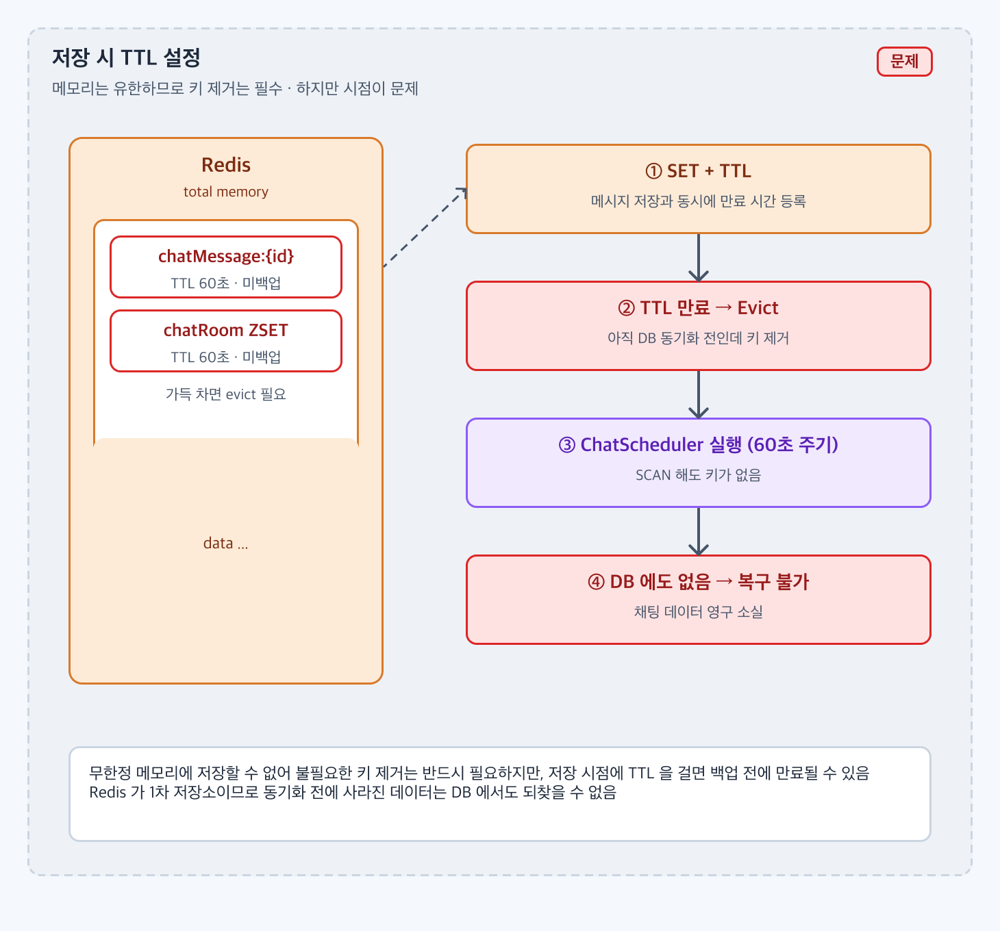
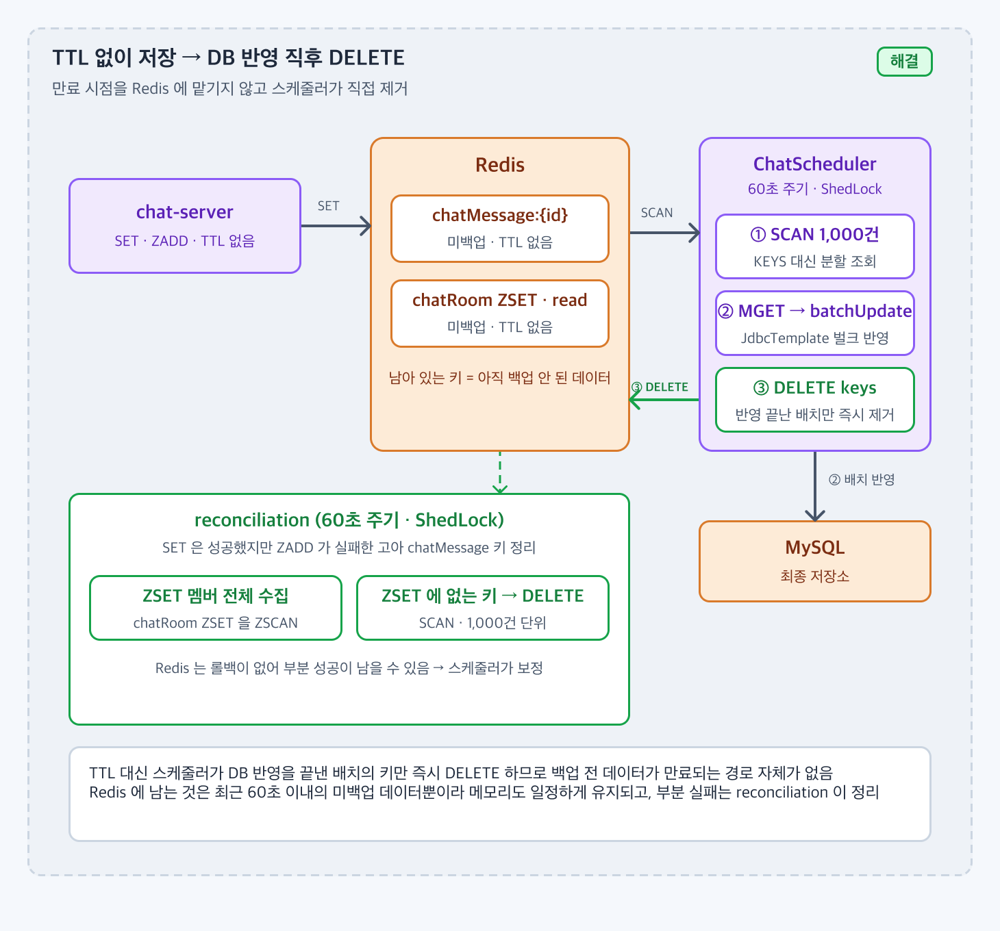

# Redis 데이터를 DB로 동기화하기 전에 삭제될 위험이 있다면, TTL 전략을 어떻게 가져가야 할까?

## 1. 문제 상황

### 배경

* 채팅 메시지 본문(`chatMessage::{id}`), 채팅방별 ZSET(`chatRoom::{roomId}`), 읽음 상태(`chatParticipantId::{userId}::{roomId}`)는 Redis 에 먼저 쓰고, `ChatScheduler` 가 60초마다 MySQL 로 옮긴다. Redis 가 1차 저장소, MySQL 이 최종 저장소다.
* Redis 는 메모리 저장소라 데이터를 무한정 쌓을 수 없다. 옮긴 데이터는 반드시 지워야 한다.
* 처음 계획은 저장 시 TTL 을 걸어 Redis 가 알아서 지우게 하는 것이었다.

### 문제

* 저장 시점에 TTL 을 걸면 **동기화 전에 만료** 될 수 있다. 스케줄러가 밀리거나(락 대기, 벌크 반영 지연), TTL 이 주기보다 짧으면 SCAN 시점에 키가 없다.
* 만료된 데이터는 DB 에도 없으므로 **복구가 불가능** 하다. 채팅 메시지가 영구 소실된다.
* `maxmemory` 에 닿았을 때의 eviction 정책도 같은 문제를 만든다. 기본 정책(`noeviction`)이면 쓰기가 실패하고, LRU 계열이면 아직 백업 안 된 키가 지워질 수 있다.



저장 시 TTL 을 걸면 동기화 전에 만료될 수 있고, 만료된 데이터는 DB 에도 없어 복구할 수 없다.

---

## 2. 목표 및 제약사항

### 목표

* DB 에 반영되기 전의 데이터는 어떤 경우에도 Redis 에서 사라지지 않는다 (미백업 유실 0건).
* Redis 에는 "아직 백업 안 된 최근 데이터" 만 남아 메모리 사용량이 일정하게 유지된다.
* 동기화는 인스턴스가 여러 대여도 한 곳에서만 실행된다.

### 제약사항

* Redis 는 롤백이 없다. "DB 반영" 과 "Redis 삭제" 를 하나의 트랜잭션으로 묶을 수 없다.
* `KEYS` 는 Redis 를 블로킹하므로 쓰지 않는다. `SCAN` 으로 순회한다.
* MySQL 반영은 벌크로 해야 한다. 메시지 1건씩 INSERT 하면 60초 안에 끝나지 않는다.
* Spring Cache 도 같은 Redis 를 쓴다. 캐시 키가 데이터 키와 섞이면 SCAN 이 캐시까지 집어간다.

---

## 3. 해결책 후보 비교

| 후보 | 장점 | 단점 | 프로젝트 적합성 |
| ---- | -- | -- | -------- |
| 저장 시 TTL | 구현 가장 단순, Redis 가 알아서 정리 | 동기화 전에 만료될 수 있음. 만료 = 소실 | 목표(미백업 유실 0)와 정면 충돌 |
| 백업 완료 후 `EXPIRE` 등록 + `maxmemory-policy volatile-ttl` | 백업된 키만 만료 대상. 메모리 부족 시에도 TTL 없는(미백업) 키는 보호 | 백업 후에도 TTL 동안 메모리에 남음. `EXPIRE` 명령이 `DEL` 과 비용이 같은데 굳이 한 번 더 기다림. Redis 설정(`maxmemory-policy`)에 의존 | 안전하지만 우회적. "지울 조건" 이 시간이 아니라 "백업 완료" 라는 점을 정직하게 표현하지 못함 |
| 백업 완료 직후 `DEL` | 삭제 조건이 "DB 반영 완료" 그 자체. 남은 키 = 미백업 데이터라는 불변식이 생김. Redis 설정 무관 | 반영 후 삭제 사이에 장애가 나면 다음 회차에 중복 반영 (at-least-once) | 채택. 불변식 덕분에 모니터링과 고아 정리가 단순해짐 |
| Redis Streams + Consumer Group | ACK 기반 정확한 소비, 재처리 지원 | 기존 키 구조(ZSET score 범위 조회)를 바꿔야 함. Long Polling 도 재작성 | 구조 변경 폭이 너무 큼 |

TTL 계열은 "언제 지울지" 를 Redis 시계에 맡긴다. 그런데 이 프로젝트에서 지워도 되는 조건은 시간이 아니라 **DB 반영이 끝났는가** 다. 조건을 아는 쪽(스케줄러)이 직접 지우는 게 맞았다.

---

## 4. 최종 의사결정

### 선택한 방법

* 저장 시 **TTL 을 두지 않는다**.
* `ChatSyncService` 가 1,000건 단위로 DB 에 벌크 반영한 **직후 그 배치의 키를 `DEL`** 한다.
* 동기화 작업은 **ShedLock** 으로 한 인스턴스에서만 실행한다.



TTL 없이 저장하고, DB 반영이 끝난 배치만 스케줄러가 즉시 `DEL` 한다. Redis 에 남은 키는 항상 미백업 데이터다.

### 선택 이유

* 삭제 조건이 "반영 완료" 이므로 반영 전에 사라질 경로가 아예 없다. 목표 1 을 구조로 만족한다.
* Redis 에는 최근 60초 이내의 미백업 데이터만 남는다. 메모리 사용량이 발행량에 비례할 뿐 시간에 비례해 늘지 않는다. 목표 2.
* "남아 있는 키 = 미백업" 이라는 불변식 덕분에 reconciliation(고아 정리)이 ZSET 과 `chatMessage` 키만 비교하면 된다.
* `EXPIRE` 등록 방식과 비교하면 명령 수는 같고 `maxmemory-policy` 설정 의존이 사라진다.

---

## 5. 구현

* `ChatScheduler` — `@Scheduled(fixedDelay = 60_000)` 네 개: `syncChatMessage`, `syncChatRoomMessage`, `syncReadStatus`, `reconciliation`. 각각 `@SchedulerLock(lockAtLeastFor = 10s, lockAtMostFor = 10m)`, `RedisLockProvider`.
* `ChatSyncService`
  * `SCAN` (`MATCH` 패턴, `TYPE` 필터, `COUNT 20`) 으로 키를 순회하며 1,000개가 모이면 배치를 처리한다.
  * 메시지: `MGET` → `ChatMessageBulk` → `INSERT chat_message` (`JdbcTemplate.batchUpdate`) → `DEL keys`
  * 채팅방 ZSET: `ZRANGE 0 -1` → `UPDATE chat_message SET chat_room_id` → `DEL keys`
  * 읽음 상태: `MGET` → `INSERT read_status` → `DEL keys`
  * `delete(keys)` 는 `redisTemplate.delete(List)` 한 번으로 배치를 지운다.
* `CacheConfig` 는 Spring Cache 키 접두어를 `cache::` 로 분리했다. 기본 접두어(`chatRoom::`)가 데이터 키와 겹쳐 `ZADD` 가 `WRONGTYPE` 으로 실패하고 SCAN 이 캐시를 집어가던 문제를 막는다.
* 메시지 목록 · 최근 메시지 조회는 MySQL 을 읽으므로 최대 60초 지연이 있고, 실시간은 Long Polling 이 Redis 를 읽는다.

```
60초마다 (ShedLock, 인스턴스 1대만)
  SCAN chatMessage::* ──1,000건──▶ MGET ──▶ INSERT chat_message (batch) ──▶ DEL 1,000 keys
  SCAN chatRoom::*    ──1,000건──▶ ZRANGE ─▶ UPDATE chat_room_id (batch)  ──▶ DEL 1,000 keys
  SCAN chatParticipantId::* ─────▶ MGET ──▶ INSERT read_status (batch)   ──▶ DEL 1,000 keys
  reconciliation: ZSET 에 없는 chatMessage::* ──▶ DEL
```

### 관련 코드

* [ChatScheduler](https://github.com/jude-z/carrot-repo/blob/dev/chat-server/src/main/java/jude/carrot/chatserver/scheduler/ChatScheduler.java)
* [ChatSyncService](https://github.com/jude-z/carrot-repo/blob/dev/chat-server/src/main/java/jude/carrot/chatserver/service/ChatSyncService.java)
* [ShedLockConfig](https://github.com/jude-z/carrot-repo/blob/dev/chat-server/src/main/java/jude/carrot/chatserver/config/ShedLockConfig.java)
* [ChatRepositoryImpl (batchUpdate)](https://github.com/jude-z/carrot-repo/blob/dev/infra/src/main/java/jude/carrot/infra/repository/chat/ChatRepositoryImpl.java) · [SqlGenerator](https://github.com/jude-z/carrot-repo/blob/dev/infra/src/main/java/jude/carrot/infra/repository/sql/SqlGenerator.java)
* [CacheConfig (캐시 키 네임스페이스 분리)](https://github.com/jude-z/carrot-repo/blob/dev/chat-server/src/main/java/jude/carrot/chatserver/config/CacheConfig.java)
* 시퀀스: [USE_CASE.md 5. Redis → MySQL 동기화](../USE_CASE.md#5-redis--mysql-동기화)

> 구현 코드는 본문에 전체를 작성하지 않고 실제 GitHub 코드로 연결한다.

---

## 6. 검증 및 결과

### 검증 방법

* `ChatSyncServiceTest` (단위, Redis · Repository mocking)
  * 키가 1,000개 미만이면 마지막에 한 번 벌크 저장
  * 1,000개를 넘으면 1,000개 단위로 나누어 벌크 저장 (메시지 · 채팅방 · 읽음 상태 각각)
  * 스캔할 키가 없으면 벌크 저장을 호출하지 않음
  * reconciliation 이 ZSET 에 없는 키만 삭제하고, 고아가 없으면 삭제하지 않음
* `ChatRepositoryTest` (Testcontainers MySQL) — 벌크 INSERT / UPDATE 가 실제 DB 에 반영되는지.
* 통합 확인 (수동): 메시지를 발행하고 60초 뒤 `chat_message` 에 행이 생기고 `chatMessage::*` 키가 사라지는지, `redis-cli --scan --pattern 'chatMessage::*' | wc -l` 이 발행량 이상으로 늘지 않는지.
* 부하 테스트 중 Redis `used_memory` 추이와 `SCAN` 처리 시간(`KEYS` 대비 블로킹 여부).

### 결과

| 지표 | 저장 시 TTL (기존 계획) | 반영 직후 DEL (개선 후) |
| ---- | -: | ---: |
| 동기화 전 만료로 인한 유실 | 발생 가능 | 구조상 0 |
| Redis 잔존 키 | TTL 만료까지 누적 | 최근 60초 이내 미백업 데이터만 |
| 배치 분할 동작 | - | 1,000건 단위 (단위 테스트 통과) |
| 다중 인스턴스 중복 실행 | - | ShedLock 으로 1회 |
| 부하 중 `used_memory` 최대치 | 측정값 기입 | 측정값 기입 |
| 60초 회차당 동기화 소요 시간 | 측정값 기입 | 측정값 기입 |

---

## 7. 트레이드오프 및 한계

### 트레이드오프

* DB 조회(목록 · 최근 메시지)는 최대 60초 늦다. 실시간이 필요한 경로는 Redis 를 읽는 Long Polling 으로 분리했다.
* at-least-once 다. INSERT 후 `DEL` 전에 장애가 나면 다음 회차에 같은 키를 다시 INSERT 한다. 현재 SQL 이 단순 `INSERT` 라 PK 중복으로 **배치 전체가 실패** 하고 이후 회차도 같은 자리에서 막힌다.
* TTL 방식이었다면 스케줄러 코드 없이 Redis 설정만으로 정리가 됐을 것이다.

### 한계

* **동기화 순서 경합**: 세 작업이 서로 다른 락을 갖고 독립적으로 돌기 때문에 순서가 보장되지 않는다.
  * 같은 틱에서 `syncChatMessage` 가 끝난 뒤 발행된 메시지 M 은, 이어지는 `syncChatRoomMessage` 가 ZSET 에서 읽어 `UPDATE chat_message SET chat_room_id` 를 실행하지만 아직 `chat_message` 에 M 이 없어 0건 갱신되고, ZSET 키는 삭제된다.
  * 이어서 `reconciliation` 이 "ZSET 에 없는 `chatMessage::M`" 을 고아로 보고 삭제한다. M 은 Redis 와 DB 어디에도 남지 않는다.
  * 인스턴스가 여러 대면 서로 다른 인스턴스가 두 작업을 동시에 잡아 같은 경합이 더 자주 생긴다.
* ZSET 을 키 단위로 `DEL` 하므로 동기화 도중 새로 `ZADD` 된 멤버까지 함께 지워진다.
* 벌크 INSERT 와 `DEL` 이 트랜잭션으로 묶이지 않아 위 at-least-once 문제가 남는다.

### 개선 방향

* 세 작업을 **하나의 스케줄 메서드** 로 합쳐 메시지 → 채팅방 매핑 → 읽음 상태 순서를 고정하고, 락도 하나로 둔다.
* ZSET 은 `DEL` 대신 반영한 멤버만 `ZREM` / `ZREMRANGEBYSCORE` 로 지워, 동기화 중 들어온 멤버를 보존한다.
* reconciliation 은 생성된 지 일정 시간(예: 2회차 이상) 지난 키만 대상으로 해 정상 메시지를 고아로 오판하지 않게 한다.
* `INSERT ... ON DUPLICATE KEY UPDATE` 로 멱등하게 만들어 재실행이 안전하게 한다.
* 규모가 커지면 Redis Streams 의 consumer group ACK 로 "반영 완료" 를 표현하는 구조를 검토한다.
