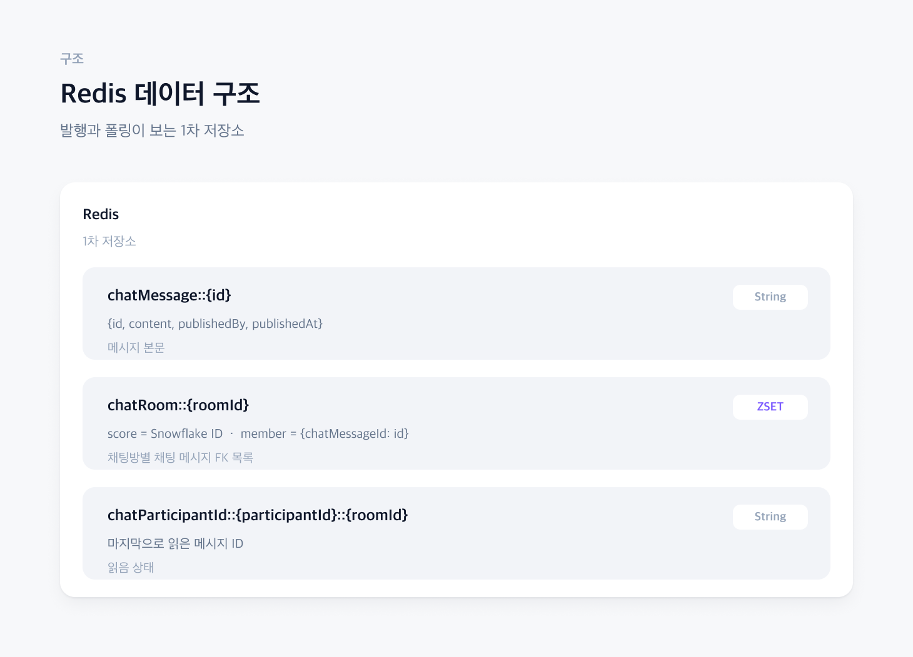
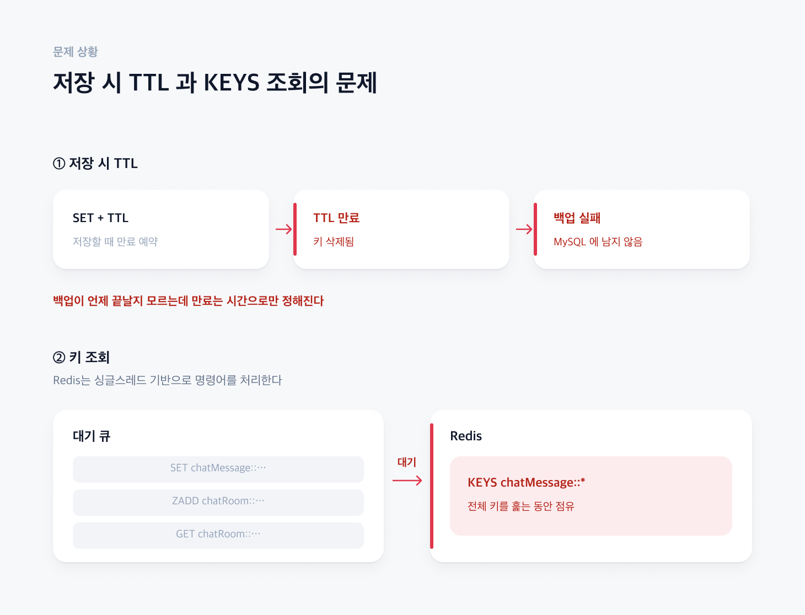
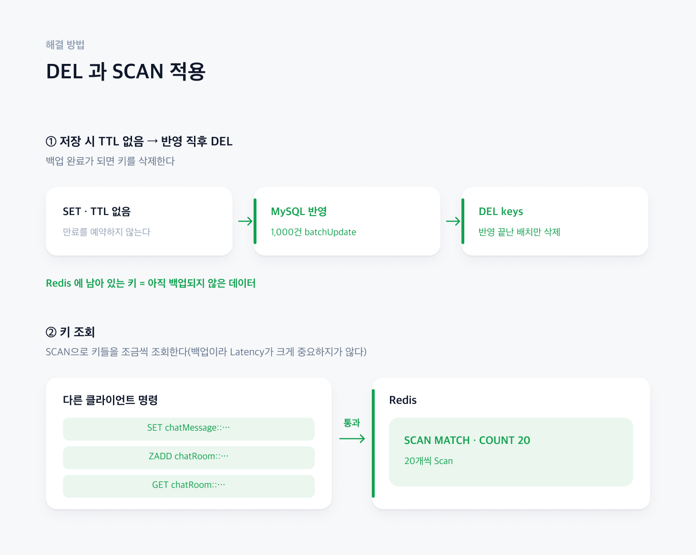

# TTL 키 전략을 어떤식으로 가져가야할까?

채팅 메시지 본문(SET), 채팅방별 채팅메세지 FK(ZSET), 읽음 상태(SET)는 Redis 에 먼저 쓰고 `ChatScheduler` 가 60초마다 MySQL로 백업하는 구조이다. 
Redis의 메모리가 한정된 자원이기 때문에 필요없는 key들은 적절한 시기에 제거해야한다. 하지만, MySQL을 최종 데이터의 원천으로 사용하기 때문에 백업이 먼저 선행되어야한다.
그렇다면 TTL을 몇초를 설정해야할까?

## 1. 문제 상황

### [ Redis 구조 ]

### [ 저장 시 TTL 의 문제 ]

Redis에 데이터를 저장할떄 TTL을 아무리 길게 잡아도 정확히 언제 동기화가 성공할지 모르기 때문에, 데이터가 손실될 위험성이 있다.
사실상 백업이 성공 됬을 경우에만 key를 제거해야한다. 
Redis 입장에서 DEL 연산은 백업이 완료될 경우에는 추가적으로 연산하지만, TTL을 설정할 때에는 SET 명령을 수행할 때 설정할 수 있으므로, 
DEL방식이 연산을 한번 더 수행하지만, 데이터 정합성이 더 중요하기 때문에 DEL방식을 채택하기로 하였다.

### [ 키 조회 문제 ]

Redis -> MySQL로 백업하기 위해서 Key를 조회하는데, keys 명령어를 사용하게 되면 Redis 서버가 그 명령어를 수행하기 때문에 다른 명령어를 수행하지 못한다.
즉, 클라이언트 입장에서는 장기간 블로킹될 가능성이 있다.
백업의 목적이 실시간성보다는 최종적으로 동기화만 완료되면 되기 때문에, keys 대신에 Scan을 사용하여 청크 단위(1000)로 백업을 진행한다.

## 3. 해결 방법

### [ DEL 적용, Scan 적용 ]

Redis가 정상적으로 운영될 경우, TTL 같은 경우로 인하여 레디스 데이터가 손실되는 경우를 방지하였고, Keys와 같은 블로킹 명령어에 대하여 다른 클라이언트의 Latency 성능이 저하되지 않도록 하였다.

## 4.관련 코드

* [ChatScheduler](https://github.com/jude-z/carrot-repo/blob/main/chat-server/src/main/java/jude/carrot/chatserver/scheduler/ChatScheduler.java) - 60초 마다 동기화 및 ShedLock 기반으로 멀티 인스턴스 환경에서도 스케쥴러가 한번 실행
* [ChatSyncService](https://github.com/jude-z/carrot-repo/blob/main/chat-server/src/main/java/jude/carrot/chatserver/service/ChatSyncService.java) - Scan이용한 동기화
* [ChatSyncServiceTest](https://github.com/jude-z/carrot-repo/blob/main/chat-server/src/test/java/jude/carrot/chatserver/service/ChatSyncServiceTest.java)
