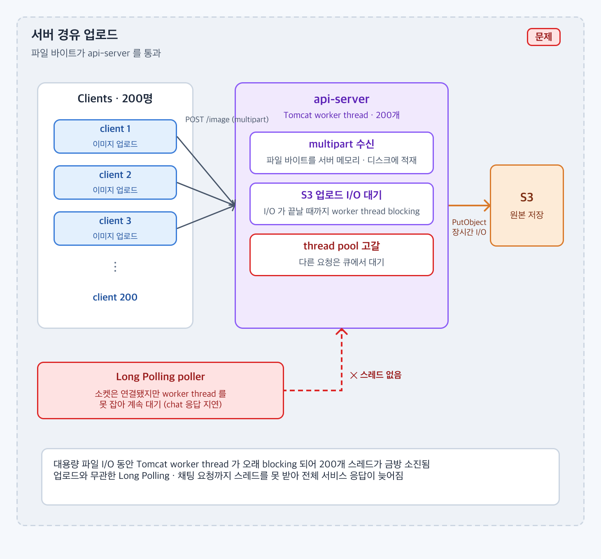
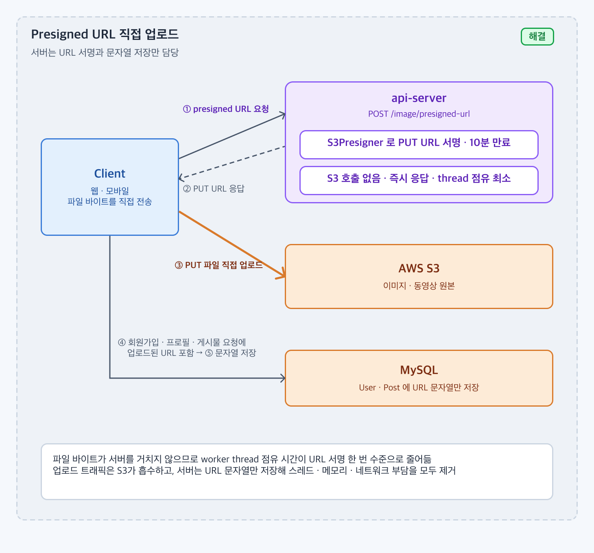

# 이미지 · 동영상 파일은 S3에 저장하는데, 꼭 서버를 거쳐야 할까?

## 1. 문제 상황

### 배경

* 회원가입 · 프로필 수정 · 게시물 등록에 이미지가 붙고, 동영상 업로드도 목표에 포함되어 있다.
* 파일 원본의 최종 저장소는 AWS S3 다. DB 에는 파일이 아니라 접근 URL 만 남긴다.
* 일반적인 구조는 클라이언트 → `api-server`(multipart) → S3 로 파일이 서버를 한 번 거치는 것이다.

### 문제

* 서버 경유 업로드는 **파일 전송이 끝날 때까지 Tomcat worker thread 를 점유** 한다. 대용량 동영상이면 수십 초 동안 스레드 하나가 묶인다.
* worker thread 는 200개다. 업로드 몇십 건이 겹치면 스레드 풀이 고갈되고, 업로드와 무관한 회원 · 게시물 요청까지 큐에서 기다린다.
* 파일 바이트가 서버 메모리 · 임시 디스크를 거치므로 인스턴스 자원과 네트워크 대역폭을 두 번 쓴다.
* 결과적으로 `api-server` 의 auto-scaling 이 업로드 트래픽에 끌려간다. 서비스 지표(연결 수 최대화)와 맞지 않는다.



파일 바이트가 api-server 를 지나는 동안 worker thread 가 묶이고, 업로드와 무관한 Long Polling 요청까지 스레드를 못 받는다.

---

## 2. 목표 및 제약사항

### 목표

* 파일 바이트가 서버를 **거치지 않게** 한다. 업로드 트래픽을 S3 가 흡수한다.
* 서버가 업로드 한 건에 쓰는 스레드 점유 시간을 "URL 서명 1회" 수준으로 줄인다.
* 인증된 회원만 업로드할 수 있어야 한다.

### 제약사항

* S3 버킷은 비공개다. 클라이언트에 자격 증명을 주지 않는다.
* 서버가 URL 문자열만 저장하는 기존 엔티티 구조(`single_image`, `multiple_image`)를 유지한다.
* 세션 쿠키 인증을 그대로 쓴다. `POST /image/presigned-url` 은 인증이 필요하다.
* 동영상 후처리(ffmpeg) 는 별도 모듈로 나중에 붙인다.

---

## 3. 해결책 후보 비교

| 후보 | 장점 | 단점 | 프로젝트 적합성 |
| ---- | -- | -- | -------- |
| 서버 경유 multipart 업로드 | 서버가 파일을 검증 · 가공할 수 있음, 구현 익숙 | 스레드 · 메모리 · 대역폭을 서버가 부담, 대용량에서 스레드 풀 고갈 | 문제의 원인 그 자체 |
| Presigned PUT URL | 서버는 서명만 함, 클라이언트가 S3 로 직접 PUT, 만료 시간으로 노출 제한 | 서버가 업로드 완료 · 파일 내용을 즉시 검증하지 못함, 클라이언트 왕복 2회 | 채택. 목표를 가장 단순하게 만족 |
| Presigned POST (policy) | 파일 크기 · Content-Type 조건을 정책으로 강제 | 폼 기반이라 클라이언트 구현이 복잡, SDK 지원이 PUT 보다 덜 단순 | 검증 조건이 필요해지면 전환 후보 |
| STS 임시 자격 증명 | 클라이언트가 SDK 로 멀티파트 업로드 등 자유롭게 사용 | 권한 범위 설계가 복잡, 자격 증명 유출 위험 | 현재 요구에 과함 |

"서버를 거쳐야 하는가" 에 대한 답은 "서명만 하면 된다" 였다. Presigned PUT 은 SDK 한 줄로 만들 수 있고, 서버가 하는 일이 서명 계산뿐이라 스레드 점유가 밀리초 단위다.

---

## 4. 최종 의사결정

### 선택한 방법

* `POST /image/presigned-url` 이 **10분 만료 Presigned PUT URL** 을 서명해서 돌려준다.
* 클라이언트가 그 URL 로 S3 에 **직접 PUT** 한다.
* 업로드된 URL 문자열을 회원가입 · 프로필 수정 · 게시물 등록 요청에 실어 보내고, 서버는 **문자열만 저장** 한다.



서버는 10분짜리 PUT URL 만 서명하고, 파일은 클라이언트가 S3 로 직접 올린다. 서버에는 URL 문자열만 저장된다.

### 선택 이유

* 파일 바이트가 서버를 전혀 거치지 않으므로 worker thread · 메모리 · 대역폭 부담이 사라진다. 목표 1, 2.
* URL 발급 API 가 세션 인증 뒤에 있으므로 회원만 URL 을 받을 수 있고, 10분이 지나면 URL 이 무효가 된다. 목표 3.
* 서명은 로컬 계산이라 이 단계에서 S3 호출이 없다. 발급 API 는 즉시 응답한다.
* 기존 "URL 문자열 저장" 구조를 그대로 쓴다. 엔티티 · API 명세 변경이 없다.

---

## 5. 구현

* `ImageController.fetchPresignedUrl` — `POST /image/presigned-url` (auth). `ImageService.fetchPresignedUrl` 결과를 `ApiResponse` 로 감싼다.
* `ImageService.createPresignedUrl(bucket, key, metadata)`
  * `S3Presigner.create()` 를 try-with-resources 로 열고
  * `PutObjectRequest(bucket, key, metadata)` 를 `PutObjectPresignRequest(signatureDuration = 10분)` 으로 감싸
  * `presignPutObject` 결과의 URL 을 문자열로 돌려준다.
  * 버킷 · 키는 `jude.s3.bucket-name`, `jude.s3.key-name` 설정값이다.
* 클라이언트 흐름
  1. `POST /image/presigned-url` → `{ "url": "https://…s3…?X-Amz-…" }`
  2. `PUT {url}` 에 파일 바이트 전송 (S3 직접)
  3. `POST /api/v1/auth/signup`, `PATCH /api/v1/users/me`, `POST /api/v1/posts` 등에 그 URL 을 문자열로 포함
  4. 서버는 `single_image` / `multiple_image` 에 URL 만 저장

```
client ── POST /image/presigned-url ──▶ api-server ── S3Presigner 서명 (S3 호출 없음, ms 단위)
client ◀── { url } ─────────────────────┘
client ── PUT {url} (파일 바이트) ──────▶ AWS S3
client ── POST /posts { imageUrls:[url] } ─▶ api-server ──▶ MySQL (URL 문자열)
```

### 관련 코드

* [ImageController](https://github.com/jude-z/carrot-repo/blob/dev/api-server/src/main/java/jude/carrot/apiserver/domain/image/controller/ImageController.java)
* [ImageService](https://github.com/jude-z/carrot-repo/blob/dev/api-server/src/main/java/jude/carrot/apiserver/domain/image/service/ImageService.java)
* [ImageRepositoryImpl (URL 저장)](https://github.com/jude-z/carrot-repo/blob/dev/infra/src/main/java/jude/carrot/infra/repository/image/ImageRepositoryImpl.java)
* API: [API.md 3.1 업로드용 presigned URL 발급](../API.md#31-업로드용-presigned-url-발급)
* 시퀀스: [USE_CASE.md 2. 이미지 직접 업로드](../USE_CASE.md#2-이미지-직접-업로드)

> 구현 코드는 본문에 전체를 작성하지 않고 실제 GitHub 코드로 연결한다.

---

## 6. 검증 및 결과

### 검증 방법

* `ImageServiceTest`
  * presigned URL 을 발급받으면 `S3Presigner` 가 생성한 URL 을 응답으로 반환한다
  * `S3Presigner` 가 실패하면 예외를 그대로 전파하고 리소스를 정리한다
* `ImageControllerTest` — 인증된 요청에 200 과 URL 이 오는지.
* `ImageRepositoryTest` (Testcontainers MySQL) — URL 문자열 저장 · 조회.
* 수동 확인: 발급받은 URL 로 `curl -X PUT --upload-file sample.jpg "{url}"` 이 200 인지, 10분 뒤 같은 URL 이 403 인지.
* 부하 관점: 업로드 N 건 동시 진행 중 `api-server` 의 `tomcat.threads.busy` 가 오르지 않는지 (서버 경유 방식과 비교).

### 결과

| 지표 | 서버 경유 (기존) | Presigned PUT (개선 후) |
| ---- | -: | ---: |
| 업로드 1건당 서버 스레드 점유 | 파일 전송 시간 전체 | URL 서명 1회 (ms 단위) |
| 서버를 지나는 파일 바이트 | 파일 크기 × 2 (수신 + S3 전송) | 0 |
| 서버 임시 저장(메모리 · 디스크) | 필요 | 없음 |
| URL 발급 시 S3 호출 | - | 0회 (로컬 서명) |
| 동시 업로드 중 `tomcat.threads.busy` | 측정값 기입 | 측정값 기입 |
| 업로드 완료까지 클라이언트 왕복 | 1회 | 2회 (발급 + PUT) |

---

## 7. 트레이드오프 및 한계

### 트레이드오프

* 클라이언트가 두 번 왕복한다(URL 발급 → PUT). 모바일에서 체감될 수 있다.
* 서버가 파일 내용을 보지 못한다. 서버 경유였다면 형식 검사 · 리사이즈 · 바이러스 검사를 업로드 시점에 할 수 있었다.
* 업로드 성공 여부를 서버가 모른다. 클라이언트가 PUT 에 실패한 URL 을 그대로 보내면 존재하지 않는 파일의 URL 이 저장된다.

### 한계

* 객체 키가 설정값(`jude.s3.key-name`) **하나로 고정** 되어 있다. 동시에 두 사용자가 업로드하면 같은 키를 덮어쓴다. 사용자 · UUID 기반 키 생성이 필요하다.
* Presigned PUT 은 Content-Type · Content-Length 를 서명에 포함하지 않으면 강제하지 못한다. 현재는 어떤 파일이든 올릴 수 있다.
* `S3Presigner` 를 요청마다 생성 · 종료한다. 빈으로 두고 재사용하면 발급 지연을 줄일 수 있다.
* 동영상 트랜스코딩(ffmpeg-server) 은 아직 붙지 않았다. 원본이 S3 에 올라간 뒤의 후처리 트리거가 없다.

### 개선 방향

* 키를 `{userId}/{uuid}.{ext}` 로 서버가 만들어 URL 에 포함하고, 저장 시 그 키만 허용한다.
* Presigned POST(policy) 또는 서명 조건에 `Content-Type`, `content-length-range` 를 넣어 파일 형식 · 크기를 S3 가 강제하게 한다.
* S3 이벤트(ObjectCreated) → SQS/Lambda 로 업로드 완료를 서버에 알려 URL 저장 시 존재 여부를 검증하고, 동영상이면 ffmpeg-server 후처리를 트리거한다.
* 규모가 커지면 CloudFront 를 앞에 두고 조회 URL 과 업로드 URL 을 분리한다.
