# 연결 상한(max-connections)을 넘는 사용자가 오면, HTTP publish 와 WebSocket 은 각각 어떻게 다르게 무너지는가?

## 1. 문제 상황

### 배경

* chat-server 는 메시지 발행을 두 가지 방식으로 받는다.
  * **HTTP publish**: `POST /api/v1/chatRoom/publish/{chatRoomId}`. 발행마다 요청 1개. Tomcat keep-alive 연결을 재사용하되, 연결 하나당 100요청(`max-keep-alive-requests`)이 지나면 닫는다.
  * **WebSocket**: `ws://host/ws/chat/{chatRoomId}`. 사용자당 연결 1개를 계속 잡고 프레임으로 발행한다.
* 두 방식 모두 Tomcat 커넥터의 `max-connections` 상한을 공유한다. 상한에 닿으면 새 연결은 accept 큐에서 기다리다 커널이 버린다(ListenOverflows).

### 문제

* 서버 한 대가 받을 수 있는 연결보다 많은 사용자가 오면 무슨 일이 일어나는지 방식별로 알지 못했다. "WebSocket 은 연결을 계속 잡으니 새 사용자를 못 받을 것" 이라는 추측은 있었지만 숫자로 확인한 적이 없었다.
* 특히 아래 세 질문에 답이 필요했다.
  1. 상한이 찬 뒤에 오는 **새 사용자가 서비스되는가**
  2. 된다면 **얼마나** (전체 처리 중 새 사용자 몫)
  3. 그 대가로 **먼저 들어온 사용자는 얼마나 밀려나는가**

---

## 2. 목표 및 제약사항

### 목표

* 세 질문을 **서버가 직접 세는 지표**로 답한다. Locust 가 기록한 클라이언트 쪽 성공률은 보조 근거로만 쓴다.
* 두 방식을 같은 조건(사용자 수, 발행 간격, 램프업, 상한)으로 돌려 한 대시보드에서 비교한다.

### 제약사항

* 상한 초과 구간을 싸게 만들기 위해 `max-connections` 를 **500** 으로 낮춘다. 1000명이 오면 절반이 상한 밖이다.
* chat-server 는 단일 인스턴스, publish 만 측정한다 (long-polling fetch 는 이번 범위 밖).
* 계정과 방은 `chat-server/src/main/resources/db/init.sql` 의 `seed_load_test` 가 미리 만든다. api-server 는 쓰지 않는다.

---

## 3. 측정 방법

### 3-1. 실험 환경

| 구성 | 내용 |
|---|---|
| chat-server | EC2 t3.large (2 vCPU / 8 GB), Corretto 21.0.12, `java -Xms2g -Xmx2g`, `ulimit -n 65536` |
| Tomcat | `max-connections=500`, `max-threads=200`(기본), `max-keep-alive-requests=100`(기본) |
| Redis | EC2, Redis 8.0.5, VPC 내부 IP |
| MySQL | RDS |
| 부하 생성 | EC2 t3.xlarge (4 vCPU), Locust 2.46.5 / Python 3.14, 워커 4개, chat-server 와 같은 VPC 내부 IP 로 호출 |
| 지표 수집 | Prometheus 5초 스크랩 (`/actuator/prometheus`), Grafana `monitoring/grafana/dashboards/carrot-chat-load.json` |

### 3-2. 시나리오

| 이름 | 방식 | 사용자 | 램프업 | 실행 시간 | Locust 스크립트 |
|---|---|---|---|---|---|
| lp-1000 | HTTP publish | 1000 | 10명/초 | 5분 (램프업 포함) | `load-test/locustfile_longpolling.py` |
| ws-1000 | WebSocket | 1000 | 10명/초 | 5분 (램프업 포함) | `load-test/locustfile_websocket.py` |

* 사용자마다 로그인(BCrypt, 타임아웃 30초) 후 **1초에 1건** 발행한다. 정상이면 1000명이 1000 req/s, 상한 안 500명만 서비스되면 500 req/s 다.
* 사용자 n 은 `load{n}a@carrot.com` 으로 로그인하고 Locust 가 n 순서로 접속한다.
* 두 실행 사이에 chat-server 를 재기동하고 Redis 를 비워서 누적 지표를 0 에서 시작했다.

### 3-3. 코호트: 서버가 "누가" 서비스됐는지 세는 방법

`ActiveClientTracker` 가 userId 로 사용자를 두 무리로 나눈다.

| cohort | 조건 | 뜻 |
|---|---|---|
| `inside` | userId ≤ 1003 | 먼저 접속하는 500명 (`load1a`~`load500a`, userId = 2n+3). 상한 **안**에 들어올 것으로 기대되는 기존 사용자 |
| `outside` | userId > 1003 | 그 뒤 500명. 상한이 찬 뒤 도착하는 **새** 사용자 |

이 위에 지표 세 개를 얹었다.

| 지표 | 종류 | 답하는 질문 |
|---|---|---|
| `chat_clients_served{transport,cohort}` | gauge | 기동 후 한 번이라도 서비스된 고유 사용자 누적. **outside 가 0 에서 안 움직이면 새 사용자를 못 받는 것** |
| `chat_requests_served_total{transport,cohort}` | counter | 서비스된 요청 수. `rate()` 로 코호트별 req/s, outside 비율(= 새 사용자 몫), inside req/s ÷ 500 (= 기존 사용자 서비스 비율, 1 이면 밀리지 않음) |
| `chat_clients_active_cohort{transport,cohort}` | gauge | 최근 30초 안에 서비스된 사용자 수. inside 가 500 아래로 떨어지면 기존 사용자가 30초 넘게 못 들어온 것 |

서버가 못 세는 것이 하나 있다. **서버에 닿지 못한 연결 시도**다. 이건 실행 전후 커널 카운터 `nstat TcpExtListenOverflows` 차이로 본다.

### 3-4. 결과 파일

실행 산출물(Locust CSV/HTML/로그, Prometheus 구간 집계, 커널 카운터)은 용량이 커서 저장소에 두지 않는다. 저장소에 남기는 건 아래 4장의 캡처와 이 문서의 숫자다. 원본이 필요하면 부록 B 로 다시 돌리고, 집계는 `load-test/prom_summary.py`(Prometheus 구간), `load-test/analyze_users.py --cap 500`(유저별), `nstat` 전후 차이(커널 카운터)로 만든다.

---

## 4. 결과

### 4-1. 한 화면 비교 (왼쪽 HTTP publish, 오른쪽 WebSocket)


핵심 4패널. **핵심 1** 누적 서비스 사용자: HTTP 는 outside(파란 선)가 0 에서 51 까지 올라가고, WebSocket 은 outside 선이 아예 없다(0). **핵심 2** 코호트별 req/s: HTTP 는 inside 가 500 아래에서 흔들리고 outside 가 그만큼 생긴다. WebSocket 은 inside 가 490 에서 평평하고 outside 는 0. **핵심 3** outside 비율: HTTP 10%, WebSocket 0%. **핵심 4** inside 서비스 비율: HTTP 는 1 아래로 떨어지고 WebSocket 은 0.98.

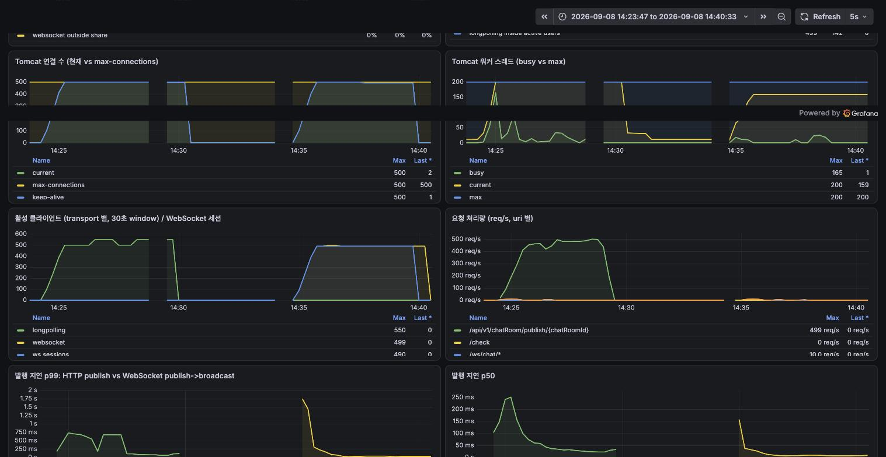

Tomcat 연결은 두 방식 다 500 에서 평평하다. 차이는 그 500 을 **누가 채우고 있는가** 다. HTTP 는 keep-alive 유휴 연결(파란 선)이 500 을 차지하고, WebSocket 은 세션 490 이 차지한다. busy 스레드는 HTTP 가 최대 165(램프업 시 200 포화), WebSocket 이 최대 25 다.

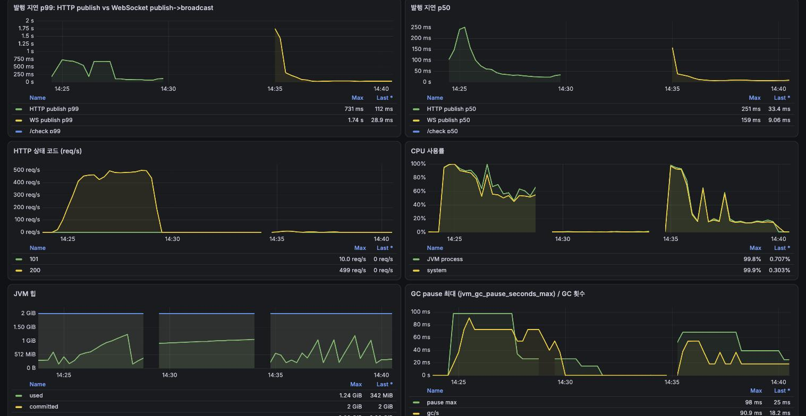

발행 지연 p99 는 HTTP 가 상한에 닿은 뒤 700ms 대에 머물다 내려오고, WebSocket 은 램프업 초반 CPU 100% 구간에서 1.7초까지 튀었다가 안정된 뒤 30ms 대다. CPU 는 HTTP 평균 70%, WebSocket 평균 33%.

### 4-2. 숫자 비교

램프업이 끝난 뒤 구간(실행 시작 +150초 ~ 끝)의 평균과, 전체 구간의 최대값이다. 서버 지표는 Prometheus 구간 집계, 유저별 숫자는 Locust 기록을 `analyze_users.py` 로 집계한 값이다.

| 항목 | HTTP publish (lp-1000) | WebSocket (ws-1000) |
|---|---|---|
| **질문 1. 새 사용자를 받는가** | | |
| `chat_clients_served` outside 최대 | **51** | **0** |
| `chat_clients_served` inside 최대 | 499 | 499 |
| Locust: 상한 밖에서 스폰된 사용자 중 로그인 성공 / 한 번이라도 발행 성공 | 51 / 51 (스폰 691) | 17 / **0** (스폰 843) |
| **질문 2. 얼마나 받는가** | | |
| outside req/s (램프업 후 평균) | 42.8 | 0 |
| outside 비율 (= outside ÷ 전체) | **9.9%** | **0%** |
| **질문 3. 기존 사용자가 밀리는가** | | |
| inside req/s (램프업 후 평균, 기대 500) | 389.6 | 481.7 |
| inside 서비스 비율 (= inside req/s ÷ 500) | **0.78** | **0.96** |
| `chat_clients_active_cohort` inside 최대 | 499 | 499 |
| Locust: 첫 500명 성공률 p50 / p10 | 1.0 / 0.995 | 1.0 / 0.996 |
| Locust: 첫 500명 중 100% 성공한 사용자 | 443 | 391 |
| Locust: 발행 p50 / p95 / p99 (ms) | 41 / 480 / 890 | 10 / 42 / 130 |
| Prometheus: 발행 p50 평균 / p99 최대 | 75ms / 0.73s | 16ms / 1.74s (램프업 초반) |
| 발행 실패 | 0 / 126,594 | 56 / 134,969 (브로드캐스트 10초 타임아웃, 램프업 구간) |
| **메커니즘** | | |
| Tomcat 연결 최대 / 상한 | 500 / 500 | 500 / 500 |
| Tomcat keep-alive 유휴 연결 최대 | 500 | 1 |
| WebSocket 세션 최대 | - | 490 |
| busy 스레드 최대 (max 200) | 200 | 51 |
| CPU 평균 / 최대 (JVM process) | 70% / 100% | 33% / 98% |
| 로그인: 시도 / 실패 (Locust) | 1,191 / 641 | 1,343 / 826 |
| 로그인 실패 종류 | 읽기 타임아웃 101, 연결 타임아웃 540 | 연결 타임아웃 368, 읽기 타임아웃 236, reset 222 |
| `nstat ListenOverflows` 증가 (서버에 닿지 못한 연결) | +5,467 | +6,763 |
| Redis 연결 누적 / TIME_WAIT | 5 / 0 | 5 / 2 |
| chat-server 로그 예외 | 없음 | `EOFException` 9 (클라이언트가 핸드셰이크 도중 끊음) |

Locust 화면. 실행 종료 시점의 Statistics 와 Charts.

| HTTP publish | WebSocket |
|---|---|
| 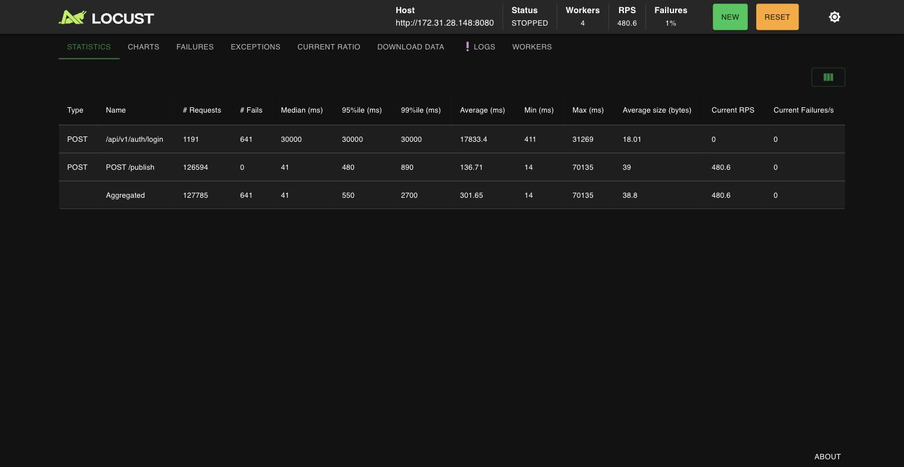 | 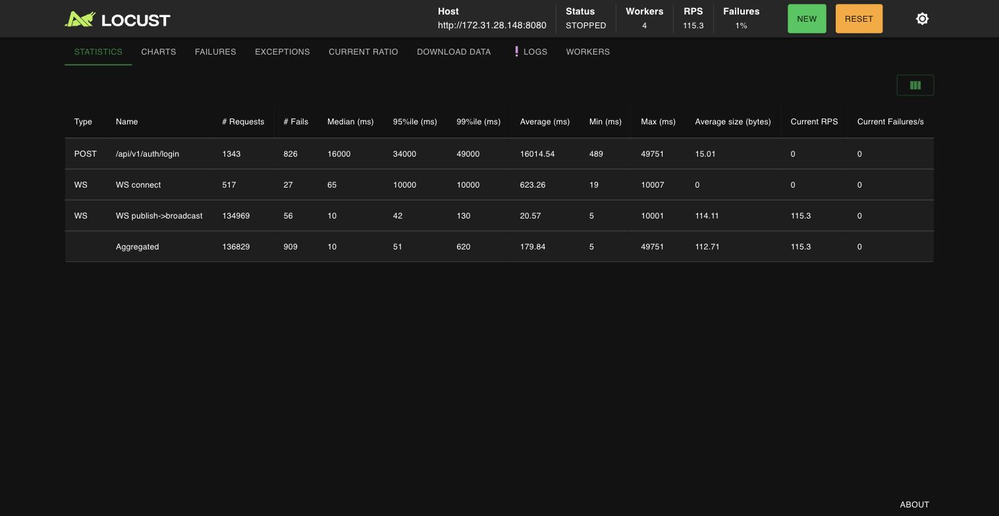 |
| 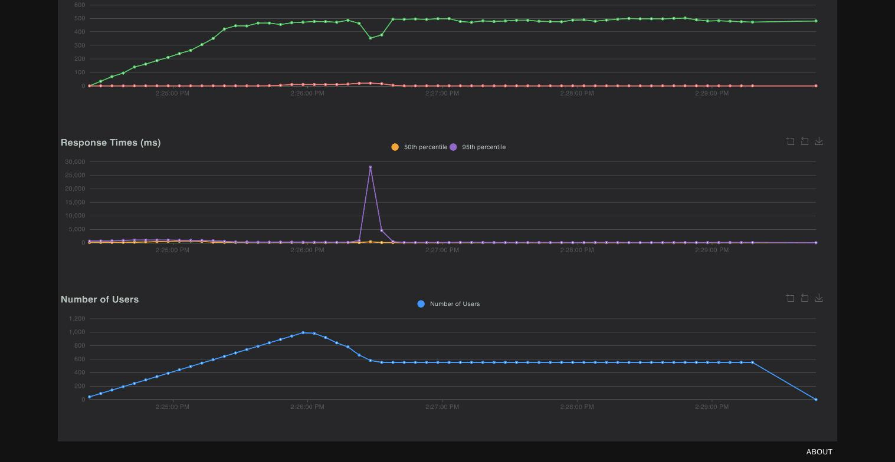 | 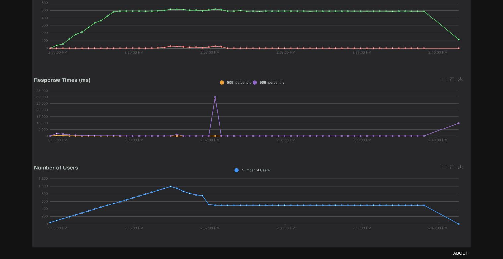 |

사용자 수 그래프가 1000 에서 550(HTTP) / 490(WebSocket) 으로 떨어지는 이유: 로그인이 30초 안에 안 되면 그 가상 사용자는 죽고, Locust 가 새 사용자를 스폰해 다시 로그인을 시도한다. 그래서 스폰 기록이 1000 을 넘고(1,191 / 1,343), 살아남은 사용자 수가 곧 "서버가 실제로 받아준 사용자 수" 다.

### 4-3. 실행별 Grafana

<details>
<summary>lp-1000 (HTTP publish)</summary>

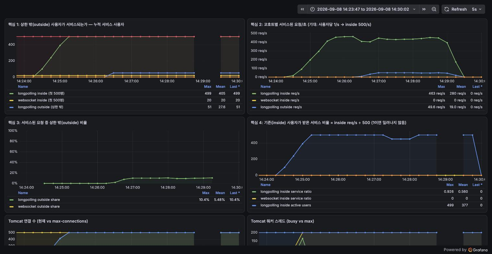
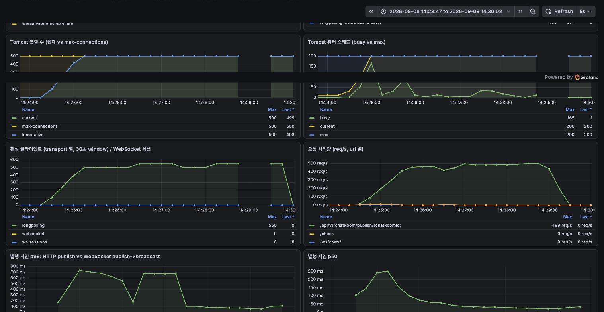
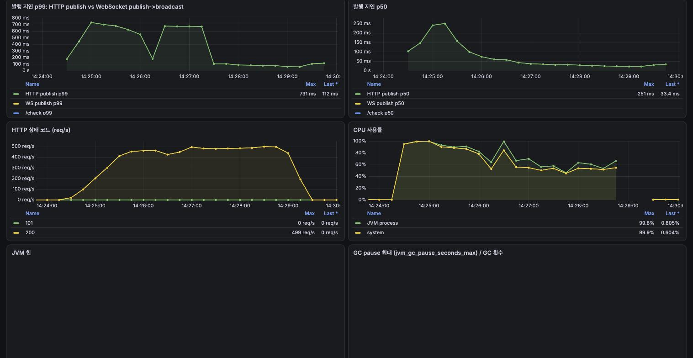
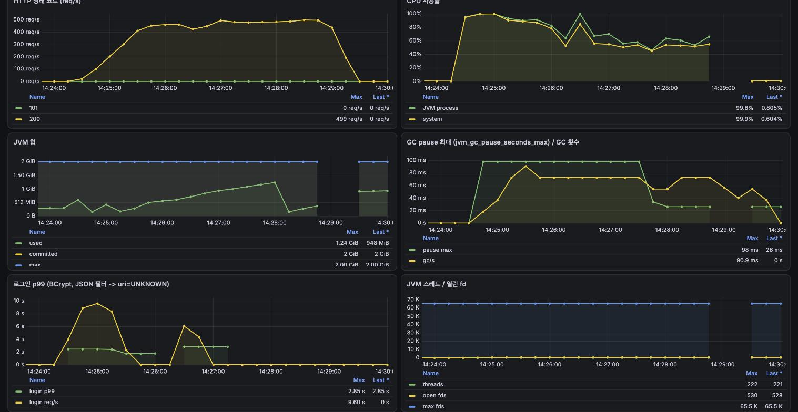


</details>

<details>
<summary>ws-1000 (WebSocket)</summary>

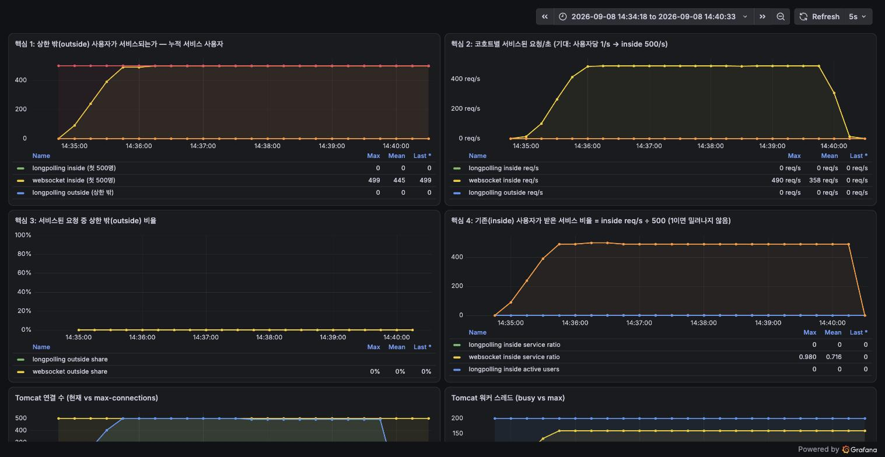
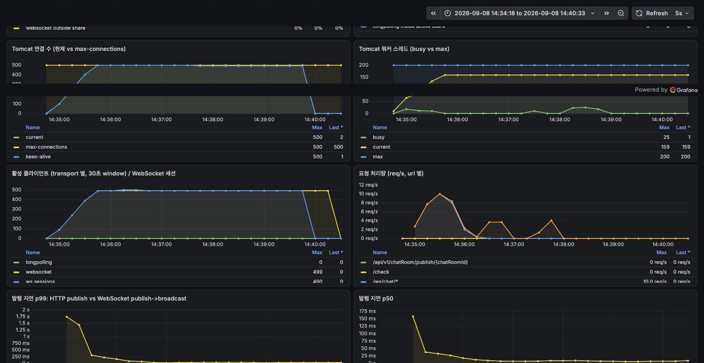
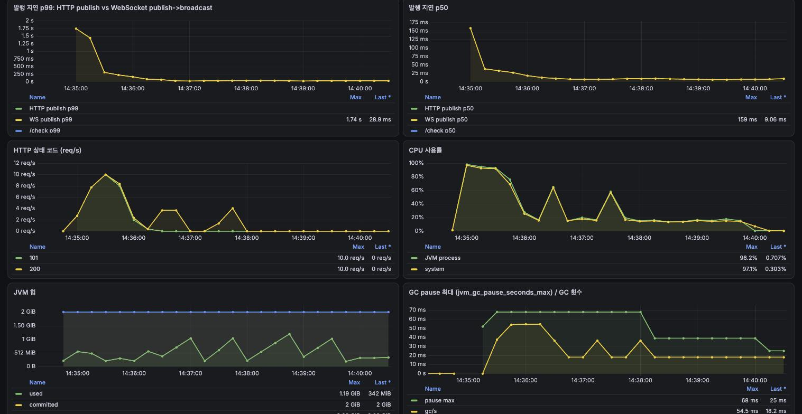
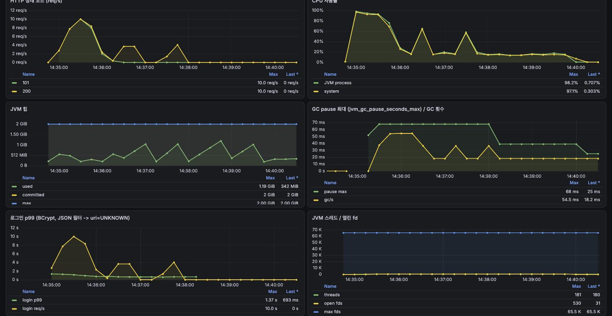
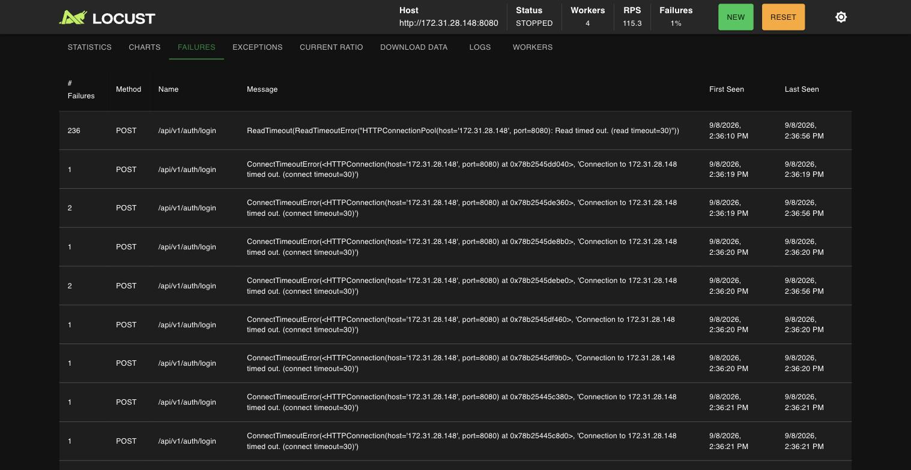

</details>

---

## 5. 분석

### 5-1. WebSocket: 상한은 **입장 통제** 로 동작한다

* 먼저 들어온 사용자가 연결을 잡고 놓지 않으니 `chat_clients_served{outside}` 가 실행 내내 **0** 이다. 상한 밖에서 스폰된 843명 중 17명이 로그인까지는 됐지만(로그인은 잠깐 열린 HTTP 연결로 가능) 핸드셰이크에 들어갈 자리가 없어 발행 성공이 0 이다.
* 들어온 사용자는 온전히 서비스된다. inside 서비스 비율 0.96, 발행 p99 130ms, busy 스레드 최대 51. 서버가 상한 밖 연결 시도를 커널 단계(ListenOverflows +6,763)에서 버리므로 애플리케이션은 부하를 거의 못 느낀다(CPU 평균 33%).
* 첫 500명 중 10명(`load490a`~`load500a`)이 핸드셰이크에 실패해 세션이 490 에서 멈췄다. 램프업 막바지에 로그인용 HTTP keep-alive 연결(스크립트가 WebSocket 연결 뒤에 닫는다)과 상한 밖 사용자의 로그인 시도가 자리를 먼저 채웠기 때문이다. 서버 지표 `served inside` 는 499 로 찍혔는데, 서버는 핸드셰이크를 완료했지만 클라이언트가 10초 타임아웃으로 먼저 끊은 9건(`WebSocketTimeoutException`)이 포함된 값이다.

### 5-2. HTTP publish: 상한은 **전원 성능 저하** 로 동작한다

* keep-alive 연결이 100요청마다 닫히면서 자리가 잠깐 비고, 그 틈으로 상한 밖 사용자가 들어온다. `served{outside}` 가 51 까지 올라가고 전체 처리의 9.9% 를 새 사용자가 가져간다.
* 그 대가는 기존 사용자가 치른다. inside 서비스 비율이 **0.78** 로, 먼저 들어온 500명이 기대치(500 req/s)의 78% 만 받았다. 발행 p99 는 890ms 로 WebSocket 의 7배, busy 스레드는 200 으로 포화, CPU 는 평균 70%.
* 다만 "밀려남" 이 완전한 퇴장은 아니었다. `active_cohort{inside}` 는 30초 창 기준 499 를 유지했고 유저별 성공률 p10 도 0.995 다. 즉 기존 사용자는 요청이 **느려지고 일부 구간에서 덜 처리되는** 형태로 밀렸지 연결을 뺏겨 나가진 않았다. 상한 밖 사용자도 일단 들어오면 성공률 1.0 이었다.
* 요약하면 HTTP 는 500 이라는 상한을 550명이 나눠 쓰는 구조가 됐다. 공정하지만 전원이 느리다.

### 5-3. 결론

| | HTTP publish | WebSocket |
|---|---|---|
| 상한 밖 사용자 | 일부 들어옴 (51명, 9.9%) | 완전 거부 (0) |
| 상한 안 사용자 | 전원 느려짐 (서비스 비율 0.78, p99 890ms) | 온전 (0.96, p99 130ms) |
| 서버 부하 | 스레드 포화, CPU 70% | CPU 33% |
| 실패 형태 | 로그인 타임아웃 641 | 로그인 타임아웃 826 + 핸드셰이크 실패 27 |

**연결 상한은 WebSocket 에서는 입장 통제, HTTP 에서는 전원 성능 저하로 나타난다.** 어느 쪽이 나은지는 정책의 문제다. "들어온 사람은 확실히 서비스하고 나머지는 명시적으로 거절" 이 필요하면 WebSocket 쪽 동작이 맞고, "느려지더라도 최대한 많이 받는다" 가 필요하면 HTTP 쪽 동작이 맞다. 채팅처럼 실시간성이 품질인 서비스에서는 전자가 낫고, 대신 거절된 사용자에게 재시도·대기열 같은 명시적 경로를 줘야 한다.

HTTP 가 새 사용자를 받는 통로는 HTTP 자체의 특성이 아니라 Tomcat 이 keep-alive 연결을 100요청마다 닫는 **설정값** 이다. `max-keep-alive-requests=-1` 로 두면 HTTP 도 WebSocket 처럼 outside 0 이 될 것으로 예상하지만 이번엔 측정하지 않았다.

---

## 6. 트레이드오프와 한계

* **publish 만 측정했다.** long-polling fetch(대기 중인 연결이 스레드를 잡는 경로)는 포함하지 않았다. fetch 까지 넣으면 HTTP 쪽 스레드 포화가 더 일찍 올 것이다.
* **스크랩 공백.** Prometheus 가 앱 포트(8080)로 스크랩하므로 상한이 꽉 찬 구간에 스크랩이 밀릴 수 있다. lp-1000 에서 14:29:00~14:29:50 KST 구간에 5초 스크랩 몇 개가 비어 있다(Grafana 의 끊긴 선). 결론에 쓴 값은 그 구간을 제외한 램프업 후 평균이다.
* **`chat_clients_active` 는 30초 창**이다. 30초 안에 한 번이라도 처리되면 활성으로 세므로 "느려짐" 은 못 잡고 "30초 이상 못 들어옴" 만 잡는다. 느려짐은 `chat_requests_served` 의 rate 로 봤다.
* **코호트 = 스폰 순서 가정.** userId ≤ 1003 이 "먼저 온 500명" 이라는 건 Locust 가 n 순서로 스폰한다는 전제다. 워커 4개가 라운드로빈으로 나눠 스폰하므로 경계 근처 수십 명은 순서가 섞일 수 있다.
* **단일 인스턴스, 5분.** 상한 초과가 장시간 이어질 때의 GC·메모리 추세는 보지 못했다.
* **Locust 가 죽은 사용자를 재스폰**하므로 로그인 시도 수(1,191 / 1,343)는 "1000명이 각각 한 번 시도" 가 아니다. 로그인 실패 수를 사용자 수로 읽으면 안 된다.

---

## 7. 개선 방향

* **WebSocket 거절 경로**: 핸드셰이크 단계에서 상한을 감지해 즉시 `503` 과 `Retry-After` 를 주고, 클라이언트는 지수 백오프로 재시도한다. 지금은 커널이 조용히 버려서 클라이언트가 30초 타임아웃까지 기다린다.
* **actuator 포트 분리**: 관리 엔드포인트를 별도 커넥터로 빼서 상한 포화 중에도 스크랩이 끊기지 않게 한다.
* **keep-alive 대조군**: `max-keep-alive-requests=-1` 로 lp-1000 을 한 번 더 돌려 5-3 의 예상을 확인한다.
* **fetch 포함 시나리오**: long-polling fetch 를 켠 HTTP 사용자로 같은 실험을 반복한다.

---

## 부록

### A. 대시보드 핵심 4패널 PromQL

```promql
# 핵심 1: 누적 서비스 사용자 (코호트별)
chat_clients_served{cohort="inside"}
chat_clients_served{cohort="outside"}

# 핵심 2: 코호트별 req/s
sum by (transport, cohort) (rate(chat_requests_served_total[30s]))

# 핵심 3: outside 비율
sum by (transport) (rate(chat_requests_served_total{cohort="outside"}[30s]))
  / sum by (transport) (rate(chat_requests_served_total[30s]))

# 핵심 4: inside 서비스 비율 (1 이면 밀리지 않음)
sum by (transport) (rate(chat_requests_served_total{cohort="inside"}[30s])) / 500
```

### B. 재현

```bash
# 1) chat-server (EC2)
REDIS_HOST=<redis-ip> nohup java -Xms2g -Xmx2g -jar chat-server-1.0.0.jar > chat.log 2>&1 &
# max-connections 500, max-keep-alive-requests 100 이 application.yml 기본값

# 2) 로컬 Prometheus/Grafana
cd monitoring && docker compose up -d      # prometheus.yml 의 targets 를 chat-server 주소로

# 3) locust-server (EC2): 웹 UI(8089)를 띄운 채 자동 시작·자동 종료, 결과는 results/<name>/
cd ~/load-test && source env.sh            # CHAT_HOST=http://<chat-server-내부-ip>:8080
./run-web-compare.sh lp-1000 locustfile_longpolling.py 1000 10 5m
# chat-server 재기동 + redis-cli flushall 후
./run-web-compare.sh ws-1000 locustfile_websocket.py 1000 10 5m

# 4) 집계
python3 load-test/prom_summary.py lp-1000 <start_epoch> <end_epoch>
python3 load-test/analyze_users.py docs/load-test/results/lp-1000 --cap 500
```

### C. 실행 시각 (UTC)

| 이름 | 시작 | 종료 |
|---|---|---|
| lp-1000 | 2026-09-08 05:24:19 | 05:29:19 |
| ws-1000 | 2026-09-08 05:34:50 | 05:39:50 |
